# Architectural Patterns: Pets API

## Overview

This document describes the architectural patterns, design patterns, and best practices used in the Pets API system.

## Layered Architecture Pattern

### Pattern Description

The system follows a layered architecture pattern with clear separation of concerns across multiple layers.

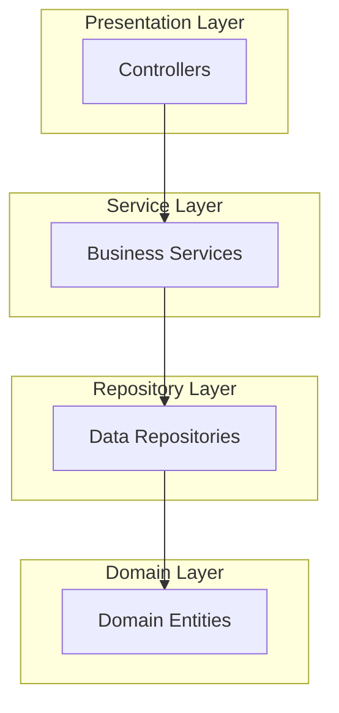

### Layer Responsibilities

**Presentation Layer (Controllers)**
- Handle HTTP requests/responses
- Request validation
- Response serialization
- Error handling

**Service Layer**
- Business logic implementation
- Transaction management
- Data transformation (Entity ↔ DTO)
- Authorization checks

**Repository Layer**
- Data access abstraction
- Query execution
- Database-specific operations

**Domain Layer**
- Entity definitions
- Domain validation
- Business rules

## Repository Pattern

### Pattern Description

Abstracts data access logic and provides a collection-like interface for domain objects.

### Implementation

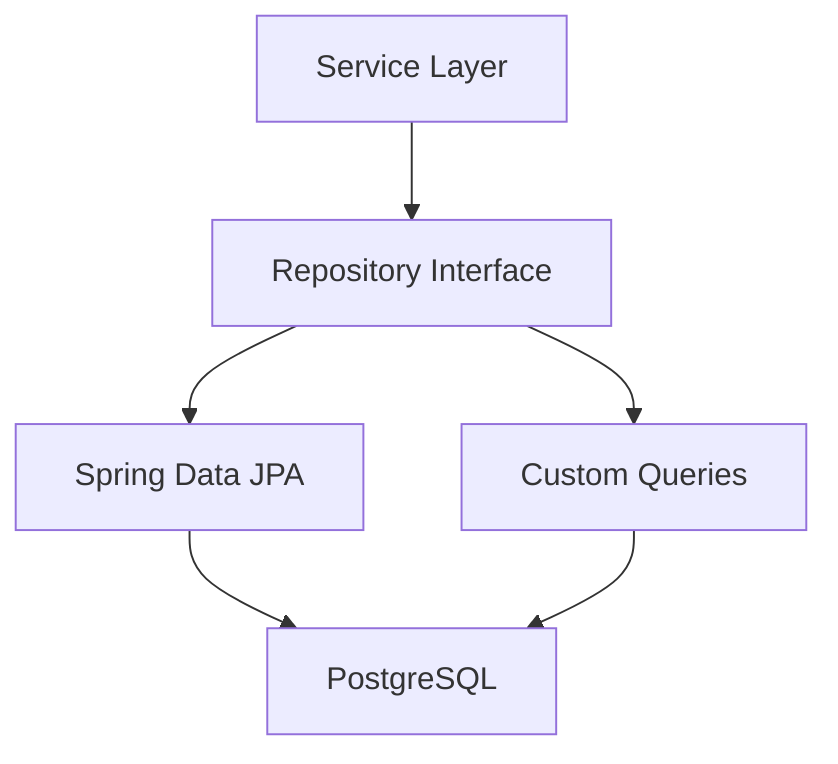

### Benefits
- Decouples business logic from data access
- Enables easy testing with mock repositories
- Provides consistent data access interface
- Supports multiple data sources

## DTO (Data Transfer Object) Pattern

### Pattern Description

Separates data transfer objects from domain entities to control API contracts and optimize data transfer.

### Implementation Flow

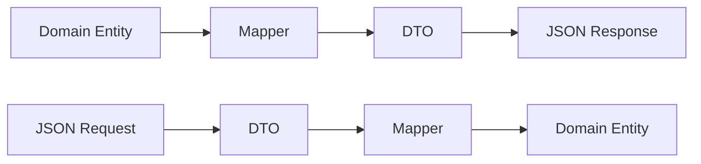

### Benefits
- Controls API contract independently of domain model
- Reduces payload size
- Prevents over-fetching
- Hides internal domain structure

## Service Layer Pattern

### Pattern Description

Encapsulates business logic in service classes, keeping controllers thin and repositories focused on data access.

### Service Responsibilities

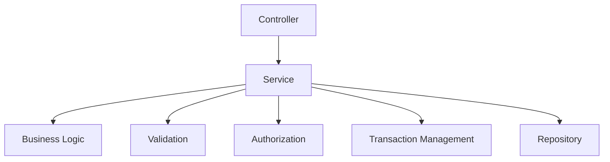

### Benefits
- Single responsibility principle
- Reusable business logic
- Easier testing
- Centralized transaction management

## Soft Delete Pattern

### Pattern Description

Marks records as deleted instead of physically removing them, preserving data for audit and recovery purposes.

### Implementation

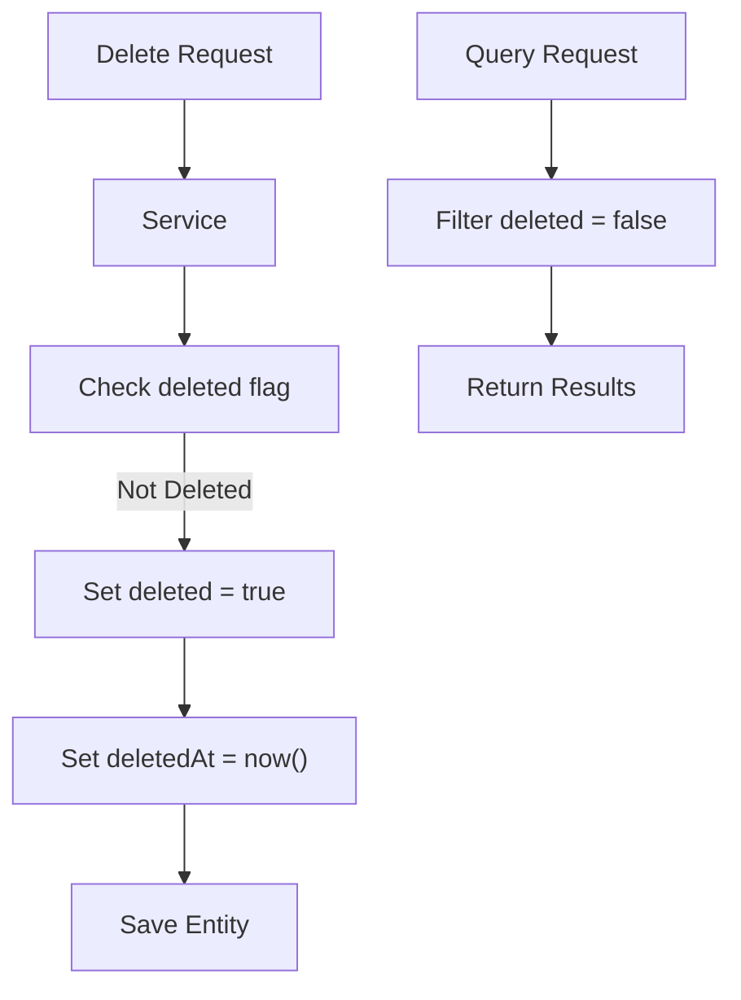

### Benefits
- Data preservation for audit trails
- Recovery capability
- Historical data analysis
- Compliance requirements

## Authentication and Authorization Pattern

### Pattern Description

JWT-based stateless authentication with role-based access control (RBAC).

### Authentication Flow

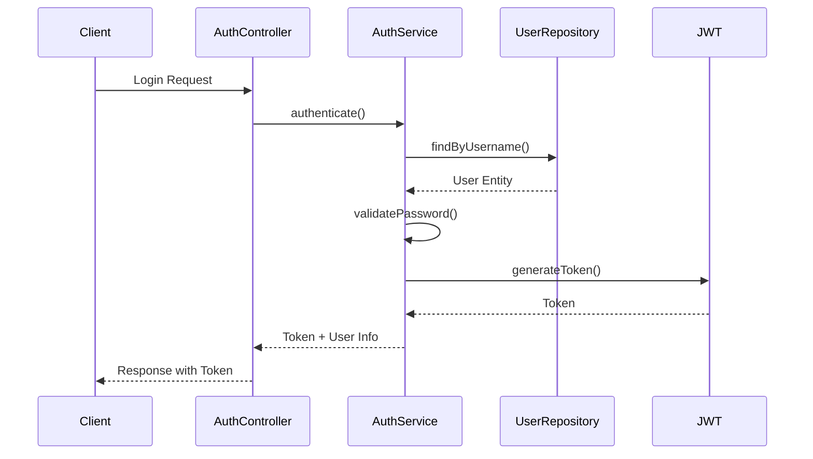

### Authorization Flow

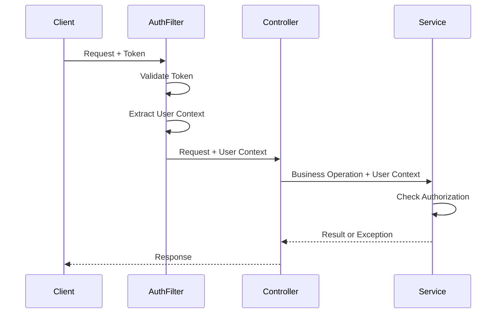

### Benefits
- Stateless authentication
- Scalable across multiple instances
- Role-based access control
- Token-based security

## API Versioning Pattern

### Pattern Description

URL-based versioning strategy to maintain backward compatibility while allowing API evolution.

### Version Routing

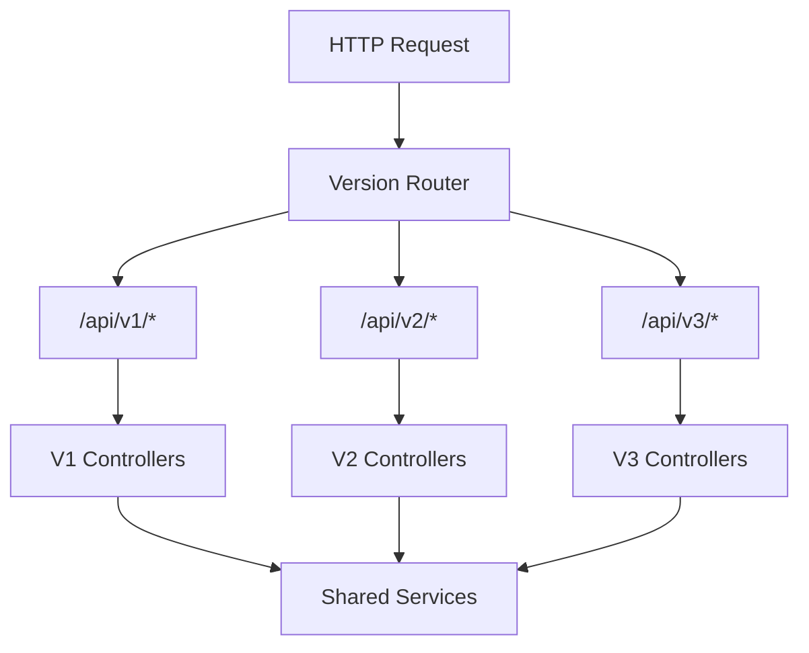

### Benefits
- Backward compatibility
- Gradual migration path
- Multiple versions support
- Clear version identification

## Exception Handling Pattern

### Pattern Description

Centralized exception handling with consistent error response format.

### Exception Hierarchy

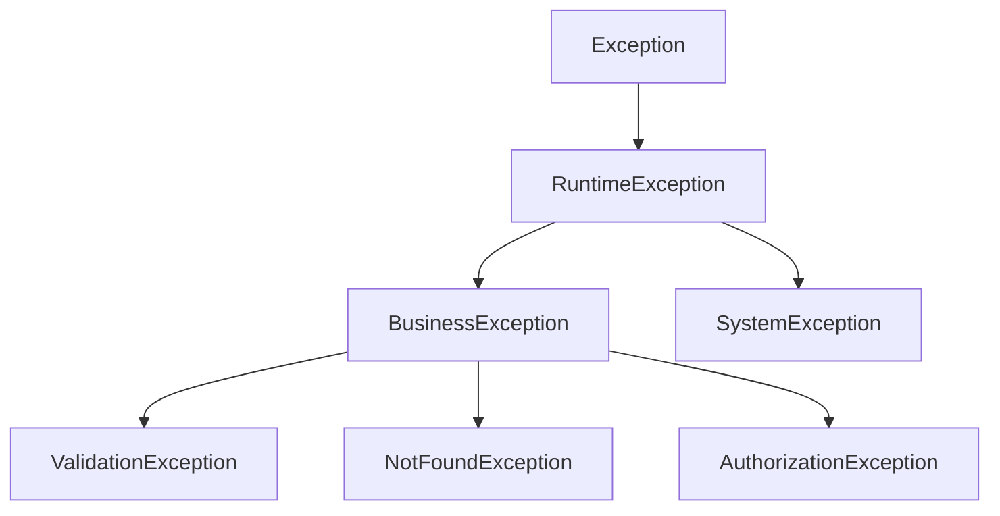

### Global Exception Handler

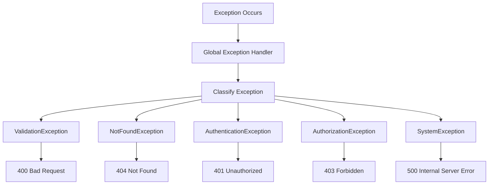

### Benefits
- Consistent error responses
- Centralized error handling
- Better error logging
- Improved debugging

## Transaction Management Pattern

### Pattern Description

Declarative transaction management using Spring's `@Transactional` annotation.

### Transaction Boundaries

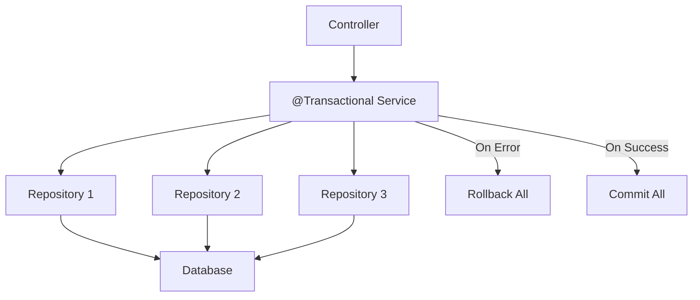

### Benefits
- ACID compliance
- Automatic rollback on errors
- Declarative configuration
- Consistent data state

## Caching Pattern

### Pattern Description

Multi-level caching strategy using Redis for frequently accessed data.

### Cache Flow

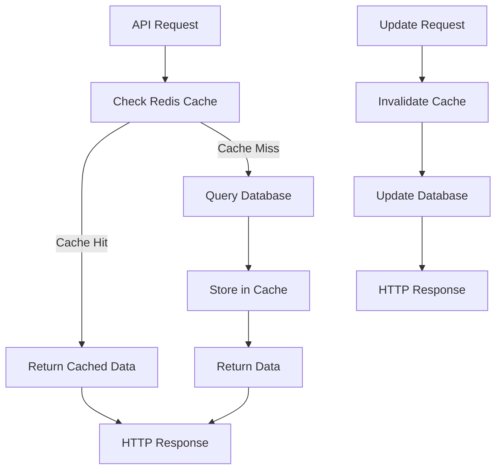

### Benefits
- Reduced database load
- Improved response times
- Better scalability
- Cost optimization

## Dependency Injection Pattern

### Pattern Description

Spring's dependency injection for loose coupling and testability.

### Dependency Graph

```mermaid
graph TB
    Controller["Controller"] -->|@Autowired| Service["Service"]
    Service -->|@Autowired| Repository["Repository"]
    Service -->|@Autowired| Cache["Cache Manager"]
    Service -->|@Autowired| Validator["Validator"]
    
    SpringContainer["Spring Container"] --> Controller
    SpringContainer --> Service
    SpringContainer --> Repository
    SpringContainer --> Cache
    SpringContainer --> Validator
```

### Benefits
- Loose coupling
- Easy testing with mocks
- Configuration management
- Lifecycle management

## Factory Pattern

### Pattern Description

Used for creating complex objects like JWT tokens, DTOs, and error responses.

### Token Factory Example

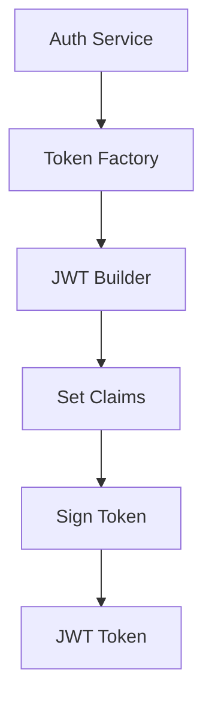

### Benefits
- Encapsulates object creation
- Consistent object creation
- Easy to extend
- Centralized configuration

## Strategy Pattern

### Pattern Description

Used for different validation strategies, sorting strategies, and filtering strategies.

### Validation Strategy

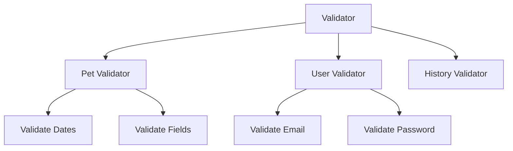

### Benefits
- Flexible validation rules
- Easy to add new strategies
- Separation of concerns
- Testable components

## Observer Pattern

### Pattern Description

Used for event handling, logging, and audit trails.

### Event Flow

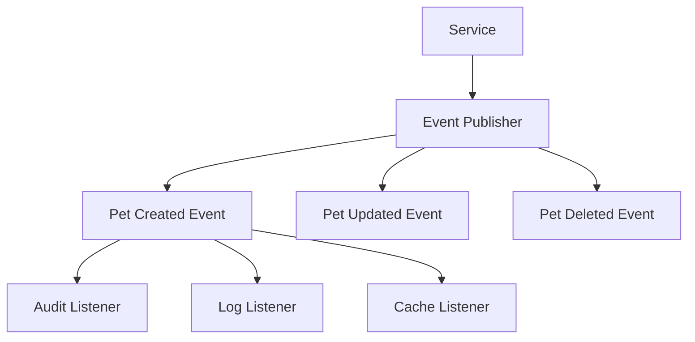

### Benefits
- Decoupled event handling
- Easy to add new listeners
- Asynchronous processing capability
- Audit trail support

## Builder Pattern

### Pattern Description

Used for constructing complex objects like query builders, DTOs, and error responses.

### Query Builder Example

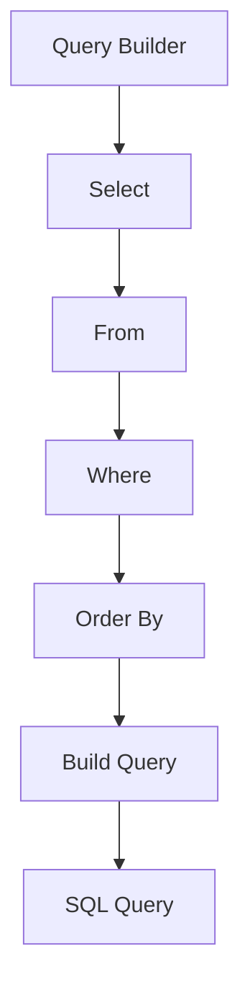

### Benefits
- Flexible object construction
- Readable code
- Immutable objects
- Validation during construction

## Singleton Pattern

### Pattern Description

Spring manages singletons for services, repositories, and configuration classes.

### Spring Singleton Scope

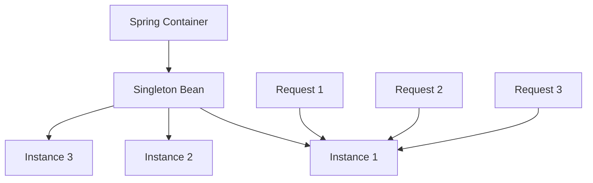

### Benefits
- Resource efficiency
- Shared state management
- Thread-safe (if properly designed)
- Centralized configuration

## Template Method Pattern

### Pattern Description

Used in Spring's JdbcTemplate, JpaTemplate, and custom service templates.

### Service Template

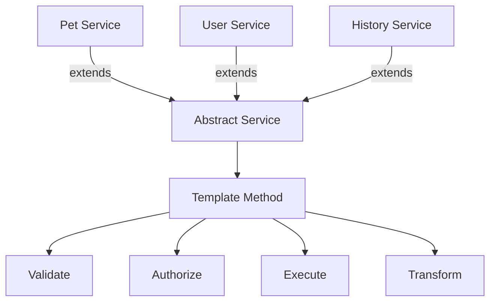

### Benefits
- Code reuse
- Consistent behavior
- Easy to extend
- Centralized common logic

## Circuit Breaker Pattern

### Pattern Description

Protects against cascading failures when calling external services or database.

### Circuit States

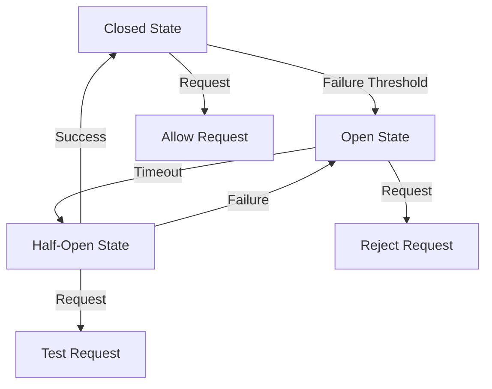

### Benefits
- Prevents cascading failures
- Fast failure response
- Automatic recovery
- System resilience

## Retry Pattern

### Pattern Description

Automatic retry for transient failures in database operations or external service calls.

### Retry Flow

```mermaid
graph TB
    Request["Service Request"] --> Attempt["Attempt"]
    Attempt --> Success{"Success?"}
    Success -->|Yes| Return["Return Result"]
    Success -->|No| CheckRetries["Check Retry Count"]
    CheckRetries -->|Under Limit| Backoff["Exponential Backoff"]
    Backoff --> Attempt
    CheckRetries -->|Limit Reached| Fail["Return Failure"]
```

### Benefits
- Handles transient failures
- Improves reliability
- Configurable retry logic
- Automatic recovery

## Token Revocation Pattern

### Pattern Description

Redis-based token blacklist for revoking JWT tokens before expiration, maintaining stateless design while enabling immediate token invalidation.

### Implementation Flow

```mermaid
sequenceDiagram
    participant Client
    participant AuthService
    participant Redis
    participant AuthFilter
    
    Client->>AuthService: POST /api/v1/auth/logout
    AuthService->>AuthService: Extract Token
    AuthService->>Redis: SET token:jwt_token "revoked" EX TTL
    Redis-->>AuthService: OK
    AuthService-->>Client: 200 OK
    
    Client->>AuthFilter: API Request + Token
    AuthFilter->>Redis: GET token:jwt_token
    Redis-->>AuthFilter: "revoked"
    AuthFilter-->>Client: 401 Unauthorized
```

### Benefits
- Immediate token invalidation
- Maintains stateless design
- Security incident response capability
- GDPR compliance support

## Rate Limiting Pattern

### Pattern Description

Multi-layer rate limiting strategy using WAF for edge protection and Redis for application-level fine-grained control.

### Rate Limiting Flow

```mermaid
graph TB
    Request["HTTP Request"] --> WAF["WAF Rate Limiter"]
    WAF -->|Rate Exceeded| Reject1["429 Too Many Requests"]
    WAF -->|Within Limits| AppLimiter["Application Rate Limiter"]
    AppLimiter -->|Check Redis| Redis["Redis Counter"]
    Redis -->|Rate Exceeded| Reject2["429 Too Many Requests"]
    Redis -->|Within Limits| Process["Process Request"]
    
    Process --> Increment["Increment Counter"]
    Increment --> Redis
```

### Benefits
- Protection against brute force attacks
- DDoS mitigation
- Resource exhaustion prevention
- Configurable per endpoint

## Defense-in-Depth Security Pattern

### Pattern Description

Multiple layers of security controls to protect against various attack vectors, ensuring that if one layer fails, others provide protection.

### Security Layers

```mermaid
graph TB
    subgraph "Layer 1: Network Security"
        WAF["AWS WAF"]
        SecurityGroups["Security Groups"]
        VPC["VPC Isolation"]
    end
    
    subgraph "Layer 2: Application Security"
        Auth["Authentication"]
        Authz["Authorization"]
        RateLimit["Rate Limiting"]
        InputValidation["Input Validation"]
    end
    
    subgraph "Layer 3: Data Security"
        EncryptionAtRest["Encryption at Rest"]
        EncryptionInTransit["Encryption in Transit"]
        DataRetention["Data Retention Policy"]
    end
    
    subgraph "Layer 4: Monitoring"
        Logging["Security Logging"]
        Monitoring["Threat Detection"]
        Alerts["Security Alerts"]
    end
    
    WAF --> Auth
    SecurityGroups --> Authz
    VPC --> RateLimit
    Auth --> EncryptionAtRest
    Authz --> EncryptionInTransit
    RateLimit --> DataRetention
    InputValidation --> Logging
    EncryptionAtRest --> Monitoring
    EncryptionInTransit --> Alerts
```

### Benefits
- Multiple protection layers
- Reduced single point of failure
- Comprehensive security coverage
- Compliance with security standards

## Best Practices Summary

### Design Principles

1. **SOLID Principles**
   - Single Responsibility
   - Open/Closed Principle
   - Liskov Substitution
   - Interface Segregation
   - Dependency Inversion

2. **DRY (Don't Repeat Yourself)**
   - Reusable components
   - Shared utilities
   - Common abstractions

3. **KISS (Keep It Simple, Stupid)**
   - Simple solutions
   - Avoid over-engineering
   - Clear code structure

4. **YAGNI (You Aren't Gonna Need It)**
   - Implement only what's needed
   - Avoid premature optimization
   - Focus on current requirements

### Security Principles

1. **Defense-in-Depth**
   - Multiple security layers
   - No single point of failure
   - Comprehensive protection

2. **Least Privilege**
   - Minimum required permissions
   - Role-based access control
   - Principle of least privilege

3. **Fail Secure**
   - Default deny policies
   - Secure error handling
   - Fail closed on errors

4. **Security by Design**
   - Security from the start
   - Regular security reviews
   - Threat modeling

### Pattern Selection Guidelines

- **Use Layered Architecture** for clear separation of concerns
- **Use Repository Pattern** for data access abstraction
- **Use DTO Pattern** for API contract control
- **Use Service Layer** for business logic encapsulation
- **Use Soft Delete** for data preservation
- **Use JWT Authentication** for stateless security
- **Use API Versioning** for backward compatibility
- **Use Exception Handling** for consistent error management

### Anti-Patterns to Avoid

1. **Anemic Domain Model**: Entities with only getters/setters
2. **God Object**: Classes with too many responsibilities
3. **Tight Coupling**: Direct dependencies between layers
4. **Hard-coded Values**: Configuration in code
5. **Circular Dependencies**: Mutual dependencies between components
6. **Premature Optimization**: Optimizing before measuring
