# System Architecture: Pets API

## Overview

The Pets API is a RESTful microservice built on Spring Boot 3, designed to provide pet management capabilities with authentication, versioning, and comprehensive data management features. The system follows a layered architecture pattern with clear separation of concerns.

## Architecture Principles

1. **Separation of Concerns**: Clear boundaries between layers (Controller, Service, Repository)
2. **Stateless Design**: API is stateless, enabling horizontal scaling
3. **Security First**: All endpoints require authentication
4. **API Versioning**: URL-based versioning for backward compatibility
5. **Soft Delete**: Data preservation through soft delete pattern
6. **RESTful Standards**: Adherence to REST principles and HTTP best practices

## System Architecture Diagram

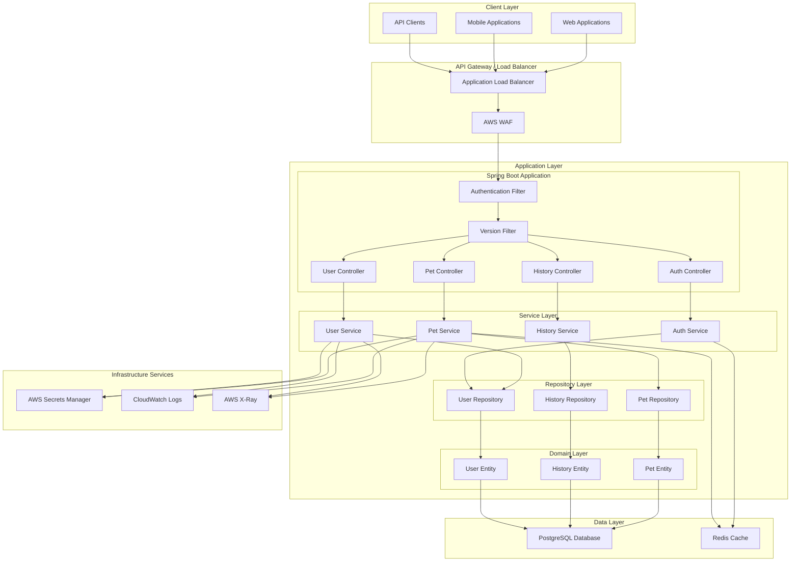

## Layered Architecture

### Presentation Layer (Controllers)

**Responsibilities:**
- Handle HTTP requests and responses
- Request validation
- Response serialization
- Error handling
- API version routing

**Components:**
- `PetController`: Pet CRUD operations
- `HistoryController`: Pet history management
- `UserController`: User management (admin)
- `AuthController`: Authentication endpoints

### Service Layer

**Responsibilities:**
- Business logic implementation
- Transaction management
- Data transformation (Entity ↔ DTO)
- Authorization checks
- Caching coordination

**Components:**
- `PetService`: Pet business logic
- `HistoryService`: History business logic
- `UserService`: User management logic
- `AuthService`: Authentication and token management

### Repository Layer

**Responsibilities:**
- Data access abstraction
- Query execution
- Soft delete filtering
- Database-specific optimizations

**Components:**
- `PetRepository`: Pet data access
- `HistoryRepository`: History data access
- `UserRepository`: User data access

### Domain Layer

**Responsibilities:**
- Entity definitions
- Domain validation
- Business rules enforcement
- Relationships management

**Components:**
- `Pet`: Pet entity with soft delete support
- `PetHistory`: History entity
- `User`: User entity with role-based access

## Component Interaction Diagram

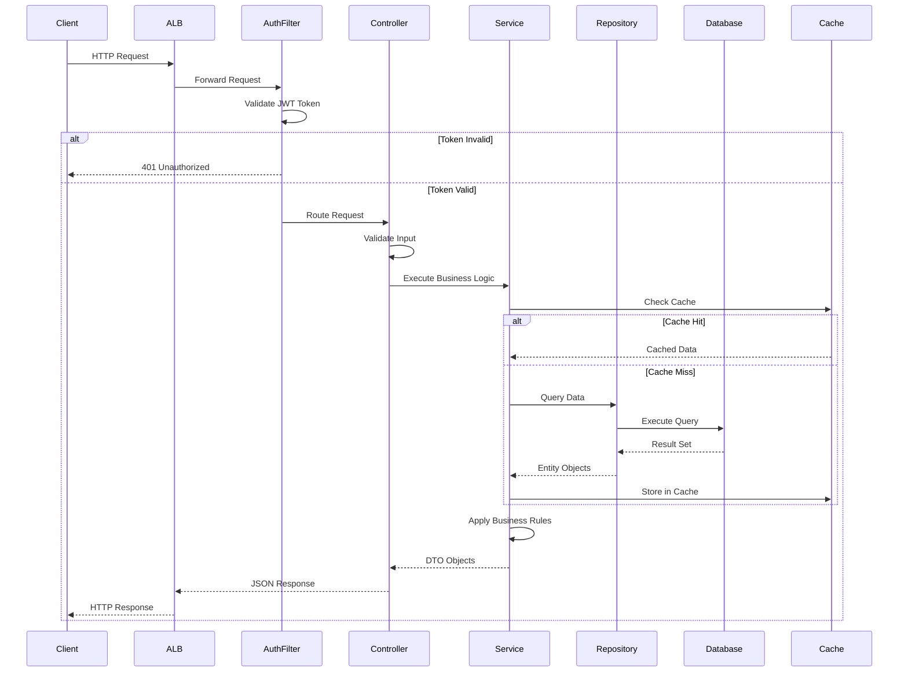

## Data Flow Architecture

```mermaid
graph LR
    subgraph "Request Flow"
        R1["HTTP Request"] --> R2["Load Balancer"]
        R2 --> R3["WAF"]
        R3 --> R4["Auth Filter"]
        R4 --> R5["Controller"]
        R5 --> R6["Service"]
        R6 --> R7["Repository"]
        R7 --> R8["Database"]
    end
    
    subgraph "Response Flow"
        D1["Database"] --> D2["Repository"]
        D2 --> D3["Service"]
        D3 --> D4["DTO Mapping"]
        D4 --> D5["Controller"]
        D5 --> D6["JSON Serialization"]
        D6 --> D7["HTTP Response"]
    end
    
    R8 --> D1
```

## Security Architecture

### Authentication Flow

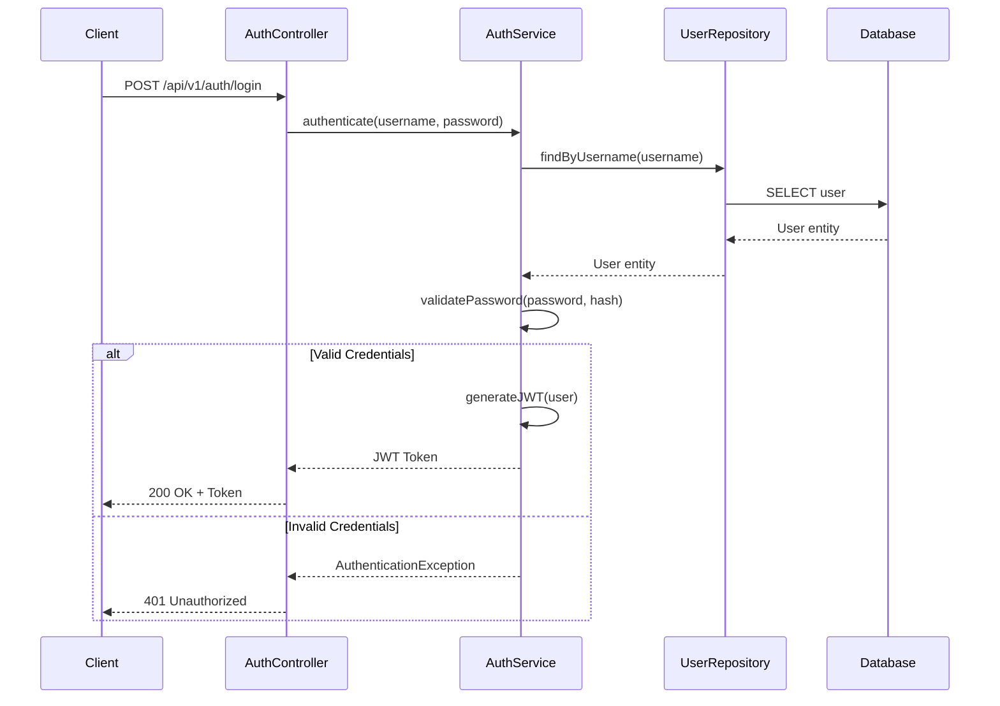

### Authorization Flow

```mermaid
sequenceDiagram
    participant Client
    participant AuthFilter
    participant TokenBlacklist["Token Blacklist<br/>(Redis)"]
    participant Controller
    participant Service
    
    Client->>AuthFilter: Request + JWT Token
    AuthFilter->>AuthFilter: Extract Token
    AuthFilter->>TokenBlacklist: Check if Token Revoked
    TokenBlacklist-->>AuthFilter: Token Status
    alt Token Revoked
        AuthFilter-->>Client: 401 Unauthorized
    else Token Not Revoked
        AuthFilter->>AuthFilter: Validate Token
        AuthFilter->>AuthFilter: Extract User Info
        alt Token Valid
            AuthFilter->>Controller: Request + User Context
            Controller->>Service: Business Operation + User Context
            Service->>Service: Check Authorization
            alt Authorized
                Service->>Service: Execute Operation
                Service-->>Controller: Result
                Controller-->>Client: Success Response
            else Unauthorized
                Service-->>Controller: AuthorizationException
                Controller-->>Client: 403 Forbidden
            end
        else Token Invalid
            AuthFilter-->>Client: 401 Unauthorized
        end
    end
```

### Token Revocation Architecture

```mermaid
graph TB
    subgraph "Token Lifecycle"
        Login["Login Request"] --> GenerateToken["Generate JWT Token"]
        GenerateToken --> StoreToken["Store Token in Response"]
        StoreToken --> UseToken["Client Uses Token"]
    end
    
    subgraph "Revocation Flow"
        RevokeRequest["Revoke Request"] --> CheckToken["Validate Token"]
        CheckToken --> AddToBlacklist["Add to Redis Blacklist"]
        AddToBlacklist --> SetTTL["Set TTL = Token Expiration"]
    end
    
    subgraph "Validation Flow"
        Request["API Request"] --> ExtractToken["Extract Token"]
        ExtractToken --> CheckBlacklist["Check Redis Blacklist"]
        CheckBlacklist -->|Revoked| Reject["Reject Request"]
        CheckBlacklist -->|Not Revoked| ValidateToken["Validate Token Signature"]
        ValidateToken -->|Valid| ProcessRequest["Process Request"]
        ValidateToken -->|Invalid| Reject
    end
```

### Rate Limiting Architecture

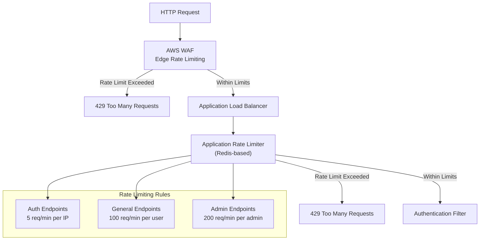

## API Versioning Strategy

### Version Routing

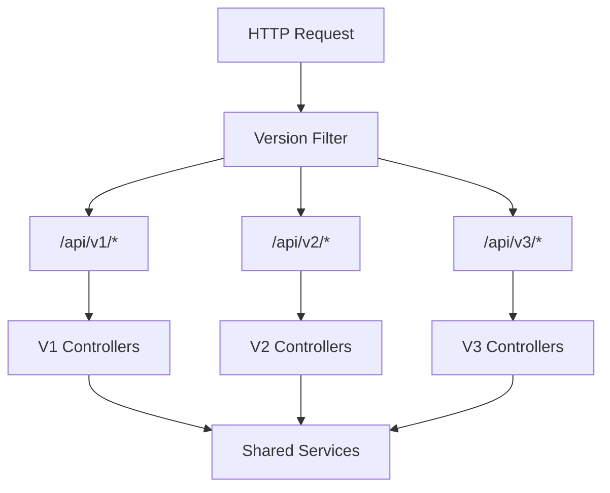

### Version Lifecycle

- **v1**: Current stable version
- **v2**: Future version (backward compatible changes)
- **v3**: Future version (breaking changes)

## Data Management Patterns

### Soft Delete Pattern

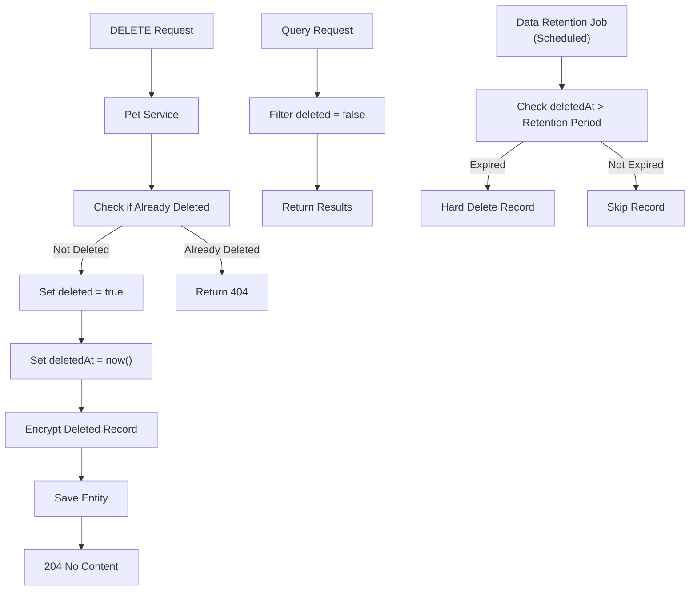

### Cascade Delete Strategy

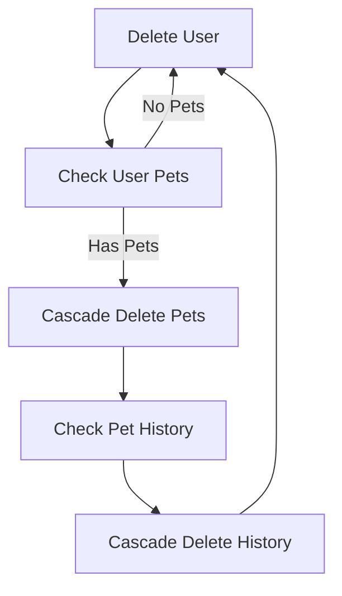

## Scalability Architecture

### Horizontal Scaling

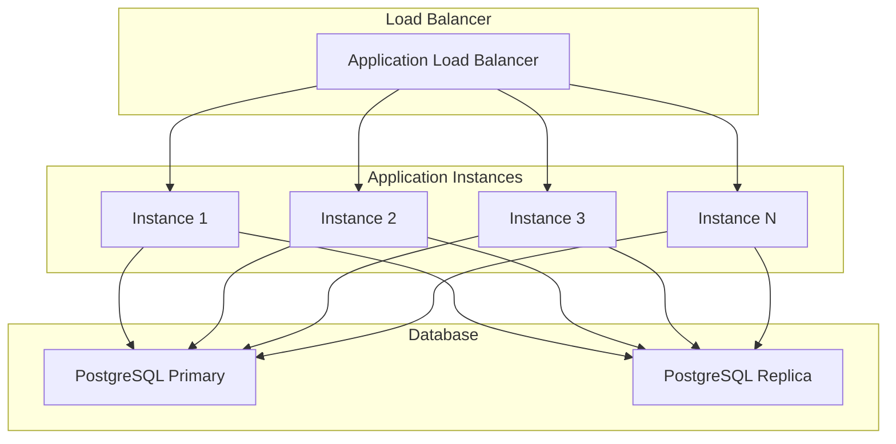

### Caching Strategy

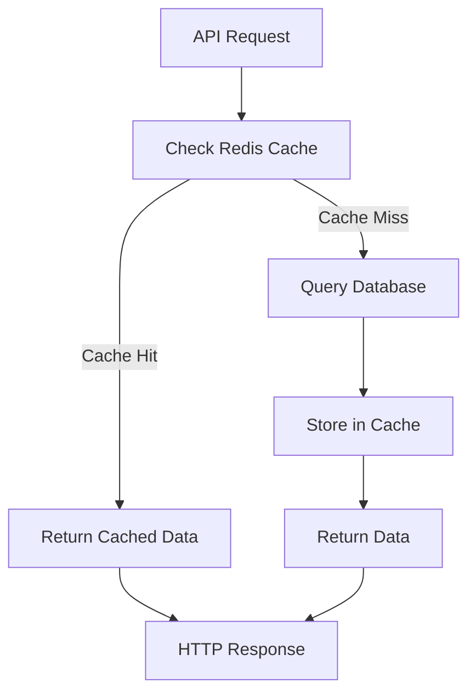

## Error Handling Architecture

### Error Flow

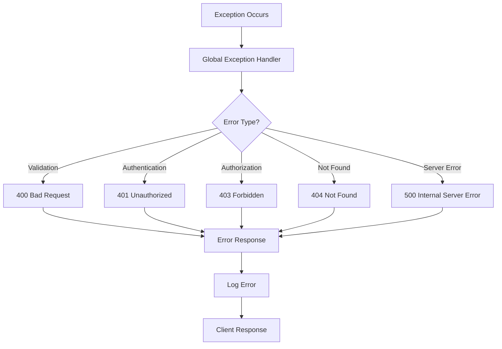

## Technology Stack

### Application Framework
- **Spring Boot 3**: Application framework
- **Spring Security**: Authentication and authorization
- **Spring Data JPA**: Data access layer
- **Spring Actuator**: Health checks and metrics

### Data Layer
- **PostgreSQL**: Primary database
- **Redis**: Caching layer
- **Flyway/Liquibase**: Database migrations

### Infrastructure
- **Docker**: Containerization
- **AWS ECS**: Container orchestration
- **AWS RDS**: Managed database
- **AWS ALB**: Load balancing
- **AWS Secrets Manager**: Secrets management

### Monitoring
- **CloudWatch**: Logging and metrics
- **AWS X-Ray**: Distributed tracing
- **Spring Actuator**: Application metrics

## Deployment Architecture

### Container Architecture

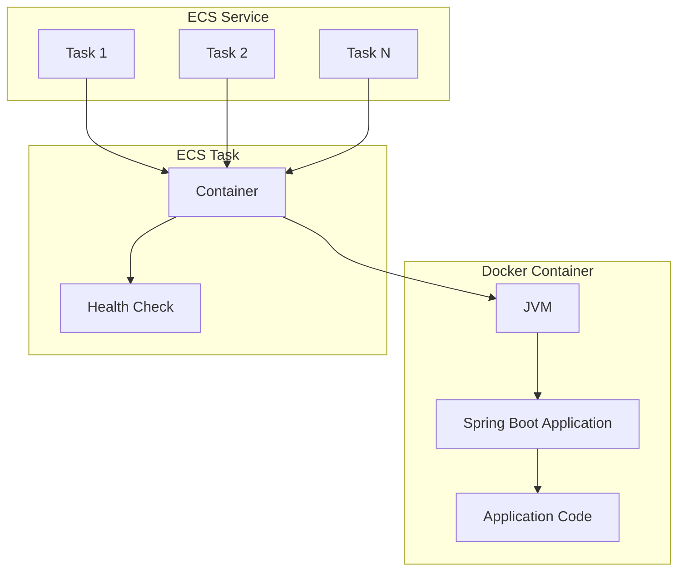

## Performance Considerations

### Database Optimization
- Connection pooling (HikariCP)
- Query optimization with indexes
- Read replicas for read-heavy workloads
- Prepared statements for SQL injection prevention

### Application Optimization
- Stateless design for load balancing
- Caching frequently accessed data
- Async processing for non-critical operations
- Efficient DTO mapping

### Network Optimization
- HTTP/2 support
- Compression (gzip)
- CDN for static assets (if applicable)
- Keep-alive connections

## Resilience Patterns

### Circuit Breaker Pattern

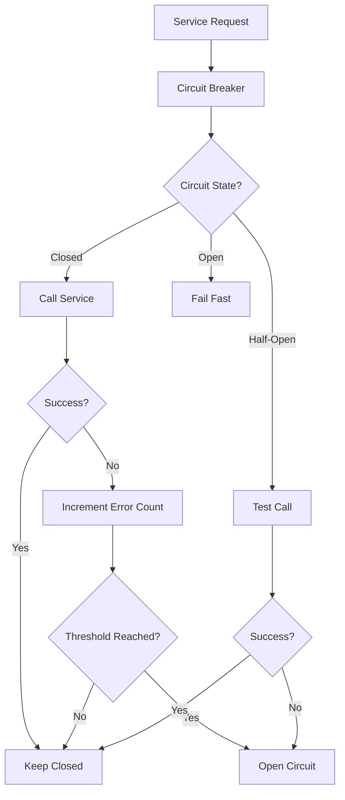

### Retry Pattern

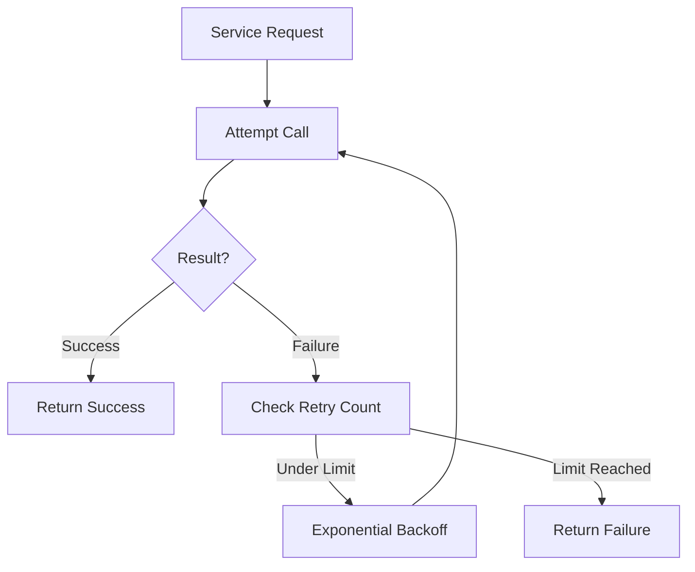

## Security Enhancements (Post Red-Blue Team Analysis)

### Token Revocation Mechanism

**Implementation:**
- Redis-based token blacklist for revoked tokens
- Token revocation endpoint (`POST /api/v1/auth/logout`)
- Blacklist check in authentication filter before token validation
- TTL set to match token expiration time

**Benefits:**
- Immediate token invalidation capability
- Maintains stateless design (Redis is external state)
- Supports security incident response
- GDPR compliance for right to be forgotten

### Rate Limiting Strategy

**Multi-Layer Approach:**
1. **WAF Level**: Edge rate limiting for DDoS protection
2. **Application Level**: Redis-based rate limiting per user/IP
3. **Endpoint-Specific**: Different limits for auth vs. general endpoints

**Rate Limits:**
- Authentication endpoints: 5 requests/minute per IP
- General API endpoints: 100 requests/minute per user
- Admin endpoints: 200 requests/minute per admin

### Actuator Endpoint Security

**Configuration:**
- Only `/actuator/health` exposed publicly (for load balancer health checks)
- `/actuator/info` requires authentication
- All other actuator endpoints disabled in production
- IP whitelisting for management endpoints (if needed)

### Security Headers

**Implemented Headers:**
- `Content-Security-Policy`: Restrict resource loading
- `X-Frame-Options: DENY`: Prevent clickjacking
- `X-Content-Type-Options: nosniff`: Prevent MIME sniffing
- `Strict-Transport-Security`: Enforce HTTPS
- `X-XSS-Protection`: Enable XSS filtering

### Data Retention Policy

**Soft Delete Enhancement:**
- Retention period: 7 years (compliance requirement)
- Automated purging job for records beyond retention
- Encryption for deleted records
- Audit logging for all deleted record access

### Password Policy Enhancement

**Requirements:**
- Minimum 8 characters
- Password complexity (uppercase, lowercase, number, special character)
- Account lockout after 5 failed attempts
- Password history (prevent reuse of last 5 passwords)
- Password expiration: 90 days (configurable)

### Request Size Limits

**Configuration:**
- Maximum request body size: 1MB
- Field length validation enforced
- Rejection of oversized requests with 413 Payload Too Large

## Future Architecture Considerations

### Microservices Evolution
- Potential split into separate services (Auth Service, Pet Service)
- Service mesh for inter-service communication
- API Gateway for centralized routing

### Event-Driven Architecture
- Event sourcing for audit trail
- Message queues for async processing
- Event-driven notifications

### Multi-Tenancy Support
- Tenant isolation at database level
- Shared schema with tenant ID
- Tenant-specific configurations

### Security Enhancements (Future)
- Multi-factor authentication (MFA) with TOTP
- Refresh token mechanism with short-lived access tokens
- Fine-grained permissions (ABAC)
- IAM database authentication
- Automated security testing (SAST/DAST)
