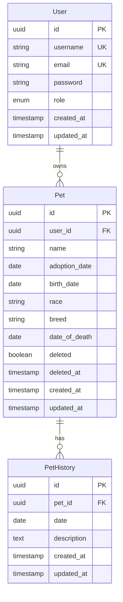

# Database Schema Design: Pets API

## Overview

This document defines the database schema for the Pets API application. The schema is designed for PostgreSQL and follows best practices for relational database design, including proper normalization, indexing, and referential integrity.

## Entity Relationship Diagram

## Table Definitions

### users

Stores user account information for authentication and authorization.

| Column Name | Data Type | Constraints | Description |
|------------|-----------|-------------|-------------|
| id | UUID | PRIMARY KEY, NOT NULL, DEFAULT gen_random_uuid() | Unique identifier for the user |
| username | VARCHAR(50) | UNIQUE, NOT NULL | Username for login (must be unique) |
| email | VARCHAR(255) | UNIQUE, NOT NULL | Email address (must be unique) |
| password | VARCHAR(255) | NOT NULL | Hashed password (BCrypt) |
| role | VARCHAR(20) | NOT NULL, DEFAULT 'USER' | User role: 'ADMIN' or 'USER' |
| created_at | TIMESTAMP | NOT NULL, DEFAULT CURRENT_TIMESTAMP | Record creation timestamp |
| updated_at | TIMESTAMP | NOT NULL, DEFAULT CURRENT_TIMESTAMP | Record last update timestamp |

**Indexes:**
- Primary Key: `id`
- Unique Index: `idx_users_username` on `username`
- Unique Index: `idx_users_email` on `email`
- Index: `idx_users_role` on `role` (for role-based queries)

**Constraints:**
- Check constraint: `role IN ('ADMIN', 'USER')`

### pets

Stores pet information associated with users. Supports soft delete functionality.

| Column Name | Data Type | Constraints | Description |
|------------|-----------|-------------|-------------|
| id | UUID | PRIMARY KEY, NOT NULL, DEFAULT gen_random_uuid() | Unique identifier for the pet |
| user_id | UUID | FOREIGN KEY, NOT NULL | Reference to the owner user |
| name | VARCHAR(100) | NOT NULL | Pet name |
| adoption_date | DATE | NOT NULL | Date when pet was adopted |
| birth_date | DATE | NOT NULL | Pet birth date |
| race | VARCHAR(50) | NOT NULL | Pet race/category |
| breed | VARCHAR(100) | NOT NULL | Pet breed |
| date_of_death | DATE | NULL | Date of death (optional) |
| deleted | BOOLEAN | NOT NULL, DEFAULT FALSE | Soft delete flag |
| deleted_at | TIMESTAMP | NULL | Timestamp when pet was soft deleted |
| created_at | TIMESTAMP | NOT NULL, DEFAULT CURRENT_TIMESTAMP | Record creation timestamp |
| updated_at | TIMESTAMP | NOT NULL, DEFAULT CURRENT_TIMESTAMP | Record last update timestamp |

**Indexes:**
- Primary Key: `id`
- Foreign Key Index: `idx_pets_user_id` on `user_id`
- Index: `idx_pets_deleted` on `deleted` (for filtering soft-deleted records)
- Composite Index: `idx_pets_user_deleted` on `(user_id, deleted)` (for user's active pets queries)
- Index: `idx_pets_name` on `name` (for search functionality)

**Constraints:**
- Foreign Key: `user_id` REFERENCES `users(id)` ON DELETE CASCADE
- Check constraint: `birth_date <= adoption_date` (logical validation)
- Check constraint: `date_of_death IS NULL OR date_of_death >= birth_date` (logical validation)
- Check constraint: `deleted = FALSE OR deleted_at IS NOT NULL` (consistency check)

**Triggers:**
- `update_updated_at`: Automatically updates `updated_at` timestamp on row update

### pet_history

Stores historical records/events for pets. Multiple records per pet are allowed.

| Column Name | Data Type | Constraints | Description |
|------------|-----------|-------------|-------------|
| id | UUID | PRIMARY KEY, NOT NULL, DEFAULT gen_random_uuid() | Unique identifier for the history record |
| pet_id | UUID | FOREIGN KEY, NOT NULL | Reference to the pet |
| date | DATE | NOT NULL | Date of the historical event |
| description | TEXT | NOT NULL | Description/details of the event |
| created_at | TIMESTAMP | NOT NULL, DEFAULT CURRENT_TIMESTAMP | Record creation timestamp |
| updated_at | TIMESTAMP | NOT NULL, DEFAULT CURRENT_TIMESTAMP | Record last update timestamp |

**Indexes:**
- Primary Key: `id`
- Foreign Key Index: `idx_pet_history_pet_id` on `pet_id`
- Composite Index: `idx_pet_history_pet_date` on `(pet_id, date DESC)` (for chronological queries)

**Constraints:**
- Foreign Key: `pet_id` REFERENCES `pets(id)` ON DELETE CASCADE

**Triggers:**
- `update_updated_at`: Automatically updates `updated_at` timestamp on row update

## Relationships

1. **User → Pet (One-to-Many)**
   - One user can own multiple pets
   - Foreign key: `pets.user_id` → `users.id`
   - Cascade delete: When a user is deleted, all their pets are deleted

2. **Pet → PetHistory (One-to-Many)**
   - One pet can have multiple history records
   - Foreign key: `pet_history.pet_id` → `pets.id`
   - Cascade delete: When a pet is deleted, all its history records are deleted

## Data Types Rationale

- **UUID**: Used for primary keys to ensure global uniqueness and avoid sequential ID enumeration attacks
- **VARCHAR**: Used for variable-length strings with appropriate length limits based on expected data
- **TEXT**: Used for `description` field to allow longer content without length restrictions
- **DATE**: Used for date-only fields (no time component needed)
- **TIMESTAMP**: Used for audit fields that require both date and time
- **BOOLEAN**: Used for flags like `deleted`

## Indexing Strategy

### Primary Indexes
- All tables use UUID primary keys with automatic generation

### Foreign Key Indexes
- All foreign key columns are indexed to optimize join operations

### Query Optimization Indexes
- `idx_pets_user_deleted`: Optimizes queries for user's active pets (most common query pattern)
- `idx_pets_deleted`: Optimizes filtering of soft-deleted records
- `idx_pet_history_pet_date`: Optimizes chronological history queries

### Search Indexes
- `idx_pets_name`: Supports pet name search functionality
- `idx_users_username` and `idx_users_email`: Support authentication lookups

## Soft Delete Implementation

The `pets` table implements soft delete functionality:
- `deleted` boolean flag indicates deletion status
- `deleted_at` timestamp records when deletion occurred
- Default queries should filter `WHERE deleted = FALSE`
- Admin queries can include deleted records with `WHERE deleted = TRUE OR deleted IS NULL`

## Audit Fields

All tables include audit fields:
- `created_at`: Automatically set on record creation
- `updated_at`: Automatically updated on record modification via trigger

## Security Considerations

1. **Password Storage**: Passwords are stored as BCrypt hashes (60-character strings)
2. **Role-Based Access**: Role field enables RBAC implementation
3. **Cascade Deletes**: Properly configured to maintain referential integrity
4. **UUID Primary Keys**: Prevent sequential ID enumeration

## Performance Considerations

1. **Indexing**: Strategic indexes on frequently queried columns
2. **Composite Indexes**: Optimize common query patterns (user + deleted, pet + date)
3. **Cascade Deletes**: Efficient cleanup of related records
4. **Soft Delete Filtering**: Index on `deleted` column for fast filtering

## Future Enhancements

Potential schema extensions:
- **pet_photos**: Table for pet image storage (if file uploads are added)
- **pet_vaccinations**: Table for vaccination records
- **pet_medical_records**: Table for medical history
- **user_preferences**: Table for user settings
- **audit_log**: Table for tracking all data changes

## Migration Notes

When implementing migrations:
1. Create tables in order: `users` → `pets` → `pet_history`
2. Create indexes after table creation
3. Create triggers for `updated_at` automation
4. Insert default admin user after `users` table creation
5. Consider adding check constraints after initial data load
