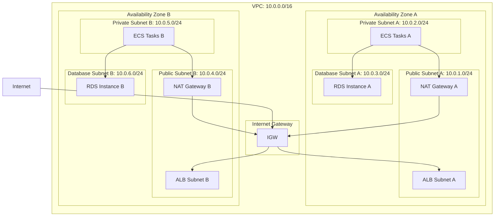

# Infrastructure Design: Pets API

## Overview

This document defines the complete infrastructure design for the Pets API application, including containerization, cloud deployment, CI/CD pipelines, monitoring, and security configurations.

## Infrastructure Architecture

### High-Level Infrastructure Diagram

```mermaid
graph TB
    subgraph "Internet"
        Users["Users"]
    end
    
    subgraph "AWS Cloud"
        subgraph "Route 53"
            DNS["DNS"]
        end
        
        subgraph "CloudFront"
            CDN["CDN"]
        end
        
        subgraph "WAF"
            WAF["Web Application Firewall"]
        end
        
        subgraph "Application Load Balancer"
            ALB["ALB"]
            TG["Target Group"]
        end
        
        subgraph "ECS Cluster"
            subgraph "Service"
                Task1["Task 1"]
                Task2["Task 2"]
                TaskN["Task N"]
            end
        end
        
        subgraph "RDS"
            PrimaryDB["PostgreSQL Primary"]
            ReplicaDB["PostgreSQL Read Replica"]
        end
        
        subgraph "ElastiCache"
            Redis["Redis Cache"]
        end
        
        subgraph "S3"
            Logs["Application Logs"]
            Artifacts["Build Artifacts"]
        end
        
        subgraph "CloudWatch"
            Metrics["Metrics"]
            LogsCW["Logs"]
            Alarms["Alarms"]
        end
        
        subgraph "VPC"
            subgraph "Public Subnets"
                NAT["NAT Gateway"]
            end
            
            subgraph "Private Subnets"
                ECSSubnet["ECS Tasks"]
                DBSubnet["RDS Instances"]
            end
        end
        
        subgraph "Security"
            SG["Security Groups"]
            IAM["IAM Roles"]
            Secrets["Secrets Manager"]
        end
    end
    
    subgraph "CI/CD"
        GitHub["GitHub"]
        Actions["GitHub Actions"]
        ECR["ECR"]
    end
    
    Users --> DNS
    DNS --> CDN
    CDN --> WAF
    WAF --> ALB
    ALB --> TG
    TG --> Task1
    TG --> Task2
    TG --> TaskN
    Task1 --> PrimaryDB
    Task2 --> PrimaryDB
    TaskN --> PrimaryDB
    Task1 --> Redis
    Task2 --> Redis
    TaskN --> Redis
    PrimaryDB --> ReplicaDB
    Task1 --> Logs
    Task2 --> Logs
    TaskN --> Logs
    Logs --> LogsCW
    Task1 --> Metrics
    Task2 --> Metrics
    TaskN --> Metrics
    Metrics --> Alarms
    GitHub --> Actions
    Actions --> ECR
    ECR --> Task1
    ECR --> Task2
    ECR --> TaskN
    Secrets --> Task1
    Secrets --> Task2
    Secrets --> TaskN
```

### Network Architecture



## Containerization

### Dockerfile

```dockerfile
FROM eclipse-temurin:17-jre-alpine

WORKDIR /app

COPY target/pets-api-*.jar app.jar

RUN addgroup -S spring && adduser -S spring -G spring
USER spring:spring

EXPOSE 8080

HEALTHCHECK --interval=30s --timeout=3s --start-period=40s --retries=3 \
  CMD wget --no-verbose --tries=1 --spider http://localhost:8080/actuator/health || exit 1

ENTRYPOINT ["java", "-jar", "app.jar"]
```

### Docker Compose (Local Development)

```yaml
version: '3.8'

services:
  postgres:
    image: postgres:15-alpine
    container_name: pets-api-db
    environment:
      POSTGRES_DB: petsdb
      POSTGRES_USER: petsuser
      POSTGRES_PASSWORD: petspassword
    ports:
      - "5432:5432"
    volumes:
      - postgres_data:/var/lib/postgresql/data
    healthcheck:
      test: ["CMD-SHELL", "pg_isready -U petsuser"]
      interval: 10s
      timeout: 5s
      retries: 5

  app:
    build:
      context: .
      dockerfile: Dockerfile
    container_name: pets-api-app
    environment:
      SPRING_DATASOURCE_URL: jdbc:postgresql://postgres:5432/petsdb
      SPRING_DATASOURCE_USERNAME: petsuser
      SPRING_DATASOURCE_PASSWORD: petspassword
      SPRING_PROFILES_ACTIVE: dev
    ports:
      - "8080:8080"
    depends_on:
      postgres:
        condition: service_healthy
    healthcheck:
      test: ["CMD", "wget", "--no-verbose", "--tries=1", "--spider", "http://localhost:8080/actuator/health"]
      interval: 30s
      timeout: 10s
      retries: 3
      start_period: 40s

volumes:
  postgres_data:
```

## AWS Infrastructure

### ECS Task Definition

```json
{
  "family": "pets-api",
  "networkMode": "awsvpc",
  "requiresCompatibilities": ["FARGATE"],
  "cpu": "512",
  "memory": "1024",
  "containerDefinitions": [
    {
      "name": "pets-api",
      "image": "YOUR_ACCOUNT.dkr.ecr.REGION.amazonaws.com/pets-api:latest",
      "portMappings": [
        {
          "containerPort": 8080,
          "protocol": "tcp"
        }
      ],
      "environment": [
        {
          "name": "SPRING_PROFILES_ACTIVE",
          "value": "prod"
        }
      ],
      "secrets": [
        {
          "name": "SPRING_DATASOURCE_URL",
          "valueFrom": "arn:aws:secretsmanager:REGION:ACCOUNT:secret:pets-api/db-url"
        },
        {
          "name": "SPRING_DATASOURCE_USERNAME",
          "valueFrom": "arn:aws:secretsmanager:REGION:ACCOUNT:secret:pets-api/db-username"
        },
        {
          "name": "SPRING_DATASOURCE_PASSWORD",
          "valueFrom": "arn:aws:secretsmanager:REGION:ACCOUNT:secret:pets-api/db-password"
        },
        {
          "name": "JWT_SECRET",
          "valueFrom": "arn:aws:secretsmanager:REGION:ACCOUNT:secret:pets-api/jwt-secret"
        }
      ],
      "logConfiguration": {
        "logDriver": "awslogs",
        "options": {
          "awslogs-group": "/ecs/pets-api",
          "awslogs-region": "us-east-1",
          "awslogs-stream-prefix": "ecs"
        }
      },
      "healthCheck": {
        "command": [
          "CMD-SHELL",
          "wget --no-verbose --tries=1 --spider http://localhost:8080/actuator/health || exit 1"
        ],
        "interval": 30,
        "timeout": 5,
        "retries": 3,
        "startPeriod": 60
      }
    }
  ],
  "executionRoleArn": "arn:aws:iam::ACCOUNT:role/ecsTaskExecutionRole",
  "taskRoleArn": "arn:aws:iam::ACCOUNT:role/ecsTaskRole"
}
```

### ECS Service Configuration

```json
{
  "serviceName": "pets-api-service",
  "cluster": "pets-api-cluster",
  "taskDefinition": "pets-api",
  "desiredCount": 2,
  "launchType": "FARGATE",
  "networkConfiguration": {
    "awsvpcConfiguration": {
      "subnets": [
        "subnet-xxxxxxxxx",
        "subnet-yyyyyyyyy"
      ],
      "securityGroups": [
        "sg-xxxxxxxxx"
      ],
      "assignPublicIp": "DISABLED"
    }
  },
  "loadBalancers": [
    {
      "targetGroupArn": "arn:aws:elasticloadbalancing:REGION:ACCOUNT:targetgroup/pets-api-tg/xxxxxxxxx",
      "containerName": "pets-api",
      "containerPort": 8080
    }
  ],
  "deploymentConfiguration": {
    "maximumPercent": 200,
    "minimumHealthyPercent": 100,
    "deploymentCircuitBreaker": {
      "enable": true,
      "rollback": true
    }
  },
  "healthCheckGracePeriodSeconds": 60
}
```

### RDS Configuration

```json
{
  "DBInstanceIdentifier": "pets-api-db",
  "DBInstanceClass": "db.t3.medium",
  "Engine": "postgres",
  "EngineVersion": "15.4",
  "MasterUsername": "admin",
  "MasterUserPassword": "SECRET_FROM_SECRETS_MANAGER",
  "AllocatedStorage": 100,
  "StorageType": "gp3",
  "StorageEncrypted": true,
  "MultiAZ": true,
  "PubliclyAccessible": false,
  "VpcSecurityGroupIds": [
    "sg-xxxxxxxxx"
  ],
  "DBSubnetGroupName": "pets-api-db-subnet-group",
  "BackupRetentionPeriod": 7,
  "PreferredBackupWindow": "03:00-04:00",
  "PreferredMaintenanceWindow": "sun:04:00-sun:05:00",
  "EnablePerformanceInsights": true,
  "PerformanceInsightsRetentionPeriod": 7,
  "DeletionProtection": true,
  "CopyTagsToSnapshot": true
}
```

### Application Load Balancer Configuration

```json
{
  "Name": "pets-api-alb",
  "Scheme": "internet-facing",
  "Type": "application",
  "IpAddressType": "ipv4",
  "Subnets": [
    "subnet-public-1",
    "subnet-public-2"
  ],
  "SecurityGroups": [
    "sg-alb-xxxxxxxxx"
  ],
  "Listeners": [
    {
      "Protocol": "HTTPS",
      "Port": 443,
      "DefaultActions": [
        {
          "Type": "forward",
          "TargetGroupArn": "arn:aws:elasticloadbalancing:REGION:ACCOUNT:targetgroup/pets-api-tg/xxxxxxxxx"
        }
      ],
      "Certificates": [
        {
          "CertificateArn": "arn:aws:acm:REGION:ACCOUNT:certificate/xxxxxxxxx"
        }
      ]
    },
    {
      "Protocol": "HTTP",
      "Port": 80,
      "DefaultActions": [
        {
          "Type": "redirect",
          "RedirectConfig": {
            "Protocol": "HTTPS",
            "Port": "443",
            "StatusCode": "HTTP_301"
          }
        }
      ]
    }
  ]
}
```

### Target Group Configuration

```json
{
  "Name": "pets-api-tg",
  "Protocol": "HTTP",
  "Port": 8080,
  "VpcId": "vpc-xxxxxxxxx",
  "TargetType": "ip",
  "HealthCheckProtocol": "HTTP",
  "HealthCheckPath": "/actuator/health",
  "HealthCheckIntervalSeconds": 30,
  "HealthCheckTimeoutSeconds": 5,
  "HealthyThresholdCount": 2,
  "UnhealthyThresholdCount": 3,
  "Matcher": {
    "HttpCode": "200"
  }
}
```

## Security Configuration

### Security Groups

#### ALB Security Group
- **Inbound Rules:**
  - Port 80 (HTTP) from 0.0.0.0/0
  - Port 443 (HTTPS) from 0.0.0.0/0
- **Outbound Rules:**
  - All traffic to ECS Security Group

#### ECS Security Group
- **Inbound Rules:**
  - Port 8080 from ALB Security Group only
- **Outbound Rules:**
  - Port 5432 to RDS Security Group
  - Port 443 (HTTPS) to 0.0.0.0/0 (for AWS API calls)

#### RDS Security Group
- **Inbound Rules:**
  - Port 5432 from ECS Security Group only
- **Outbound Rules:**
  - None

### IAM Roles

#### ECS Task Execution Role
```json
{
  "Version": "2012-10-17",
  "Statement": [
    {
      "Effect": "Allow",
      "Action": [
        "ecr:GetAuthorizationToken",
        "ecr:BatchCheckLayerAvailability",
        "ecr:GetDownloadUrlForLayer",
        "ecr:BatchGetImage",
        "logs:CreateLogStream",
        "logs:PutLogEvents",
        "secretsmanager:GetSecretValue"
      ],
      "Resource": "*"
    }
  ]
}
```

#### ECS Task Role
```json
{
  "Version": "2012-10-17",
  "Statement": [
    {
      "Effect": "Allow",
      "Action": [
        "secretsmanager:GetSecretValue"
      ],
      "Resource": [
        "arn:aws:secretsmanager:REGION:ACCOUNT:secret:pets-api/*"
      ]
    }
  ]
}
```

## CI/CD Pipeline

### GitHub Actions Workflow

```yaml
name: Build and Deploy

on:
  push:
    branches:
      - main
      - develop
  pull_request:
    branches:
      - main

env:
  AWS_REGION: us-east-1
  ECR_REPOSITORY: pets-api
  ECS_CLUSTER: pets-api-cluster
  ECS_SERVICE: pets-api-service

jobs:
  build:
    name: Build and Test
    runs-on: ubuntu-latest
    
    steps:
      - name: Checkout code
        uses: actions/checkout@v4
      
      - name: Set up JDK 17
        uses: actions/setup-java@v4
        with:
          java-version: '17'
          distribution: 'temurin'
          cache: maven
      
      - name: Run tests
        run: mvn clean test
      
      - name: Build JAR
        run: mvn clean package -DskipTests
      
      - name: Upload artifact
        uses: actions/upload-artifact@v4
        with:
          name: jar-file
          path: target/*.jar

  deploy:
    name: Deploy to AWS
    needs: build
    runs-on: ubuntu-latest
    if: github.ref == 'refs/heads/main'
    
    steps:
      - name: Checkout code
        uses: actions/checkout@v4
      
      - name: Configure AWS credentials
        uses: aws-actions/configure-aws-credentials@v4
        with:
          aws-access-key-id: ${{ secrets.AWS_ACCESS_KEY_ID }}
          aws-secret-access-key: ${{ secrets.AWS_SECRET_ACCESS_KEY }}
          aws-region: ${{ env.AWS_REGION }}
      
      - name: Login to Amazon ECR
        id: login-ecr
        uses: aws-actions/amazon-ecr-login@v2
      
      - name: Download artifact
        uses: actions/download-artifact@v4
        with:
          name: jar-file
          path: target/
      
      - name: Build, tag, and push image to Amazon ECR
        id: build-image
        env:
          ECR_REGISTRY: ${{ steps.login-ecr.outputs.registry }}
          IMAGE_TAG: ${{ github.sha }}
        run: |
          docker build -t $ECR_REGISTRY/$ECR_REPOSITORY:$IMAGE_TAG .
          docker push $ECR_REGISTRY/$ECR_REPOSITORY:$IMAGE_TAG
          echo "image=$ECR_REGISTRY/$ECR_REPOSITORY:$IMAGE_TAG" >> $GITHUB_OUTPUT
      
      - name: Fill in the new image ID in the Amazon ECS task definition
        id: task-def
        uses: aws-actions/amazon-ecs-render-task-definition@v1
        with:
          task-definition: .aws/task-definition.json
          container-name: pets-api
          image: ${{ steps.build-image.outputs.image }}
      
      - name: Deploy Amazon ECS task definition
        uses: aws-actions/amazon-ecs-deploy-task-definition@v1
        with:
          task-definition: ${{ steps.task-def.outputs.task-definition }}
          service: ${{ env.ECS_SERVICE }}
          cluster: ${{ env.ECS_CLUSTER }}
          wait-for-service-stability: true
```

## Monitoring and Logging

### CloudWatch Logs Configuration

- **Log Group:** `/ecs/pets-api`
- **Retention:** 30 days
- **Log Stream Prefix:** `ecs`

### CloudWatch Alarms

#### High CPU Utilization
```json
{
  "AlarmName": "pets-api-high-cpu",
  "MetricName": "CPUUtilization",
  "Namespace": "AWS/ECS",
  "Statistic": "Average",
  "Period": 300,
  "EvaluationPeriods": 2,
  "Threshold": 80,
  "ComparisonOperator": "GreaterThanThreshold",
  "AlarmActions": ["arn:aws:sns:REGION:ACCOUNT:alerts"]
}
```

#### High Memory Utilization
```json
{
  "AlarmName": "pets-api-high-memory",
  "MetricName": "MemoryUtilization",
  "Namespace": "AWS/ECS",
  "Statistic": "Average",
  "Period": 300,
  "EvaluationPeriods": 2,
  "Threshold": 85,
  "ComparisonOperator": "GreaterThanThreshold",
  "AlarmActions": ["arn:aws:sns:REGION:ACCOUNT:alerts"]
}
```

#### Unhealthy Target
```json
{
  "AlarmName": "pets-api-unhealthy-target",
  "MetricName": "UnHealthyHostCount",
  "Namespace": "AWS/ApplicationELB",
  "Statistic": "Average",
  "Period": 60,
  "EvaluationPeriods": 2,
  "Threshold": 1,
  "ComparisonOperator": "GreaterThanThreshold",
  "AlarmActions": ["arn:aws:sns:REGION:ACCOUNT:alerts"]
}
```

#### Database Connection Count
```json
{
  "AlarmName": "pets-api-db-connections",
  "MetricName": "DatabaseConnections",
  "Namespace": "AWS/RDS",
  "Statistic": "Average",
  "Period": 300,
  "EvaluationPeriods": 2,
  "Threshold": 80,
  "ComparisonOperator": "GreaterThanThreshold",
  "AlarmActions": ["arn:aws:sns:REGION:ACCOUNT:alerts"]
}
```

## Scalability Configuration

### Auto Scaling Configuration

#### ECS Service Auto Scaling
```json
{
  "ServiceName": "pets-api-service",
  "ClusterName": "pets-api-cluster",
  "ScalableDimension": "ecs:service:DesiredCount",
  "MinCapacity": 2,
  "MaxCapacity": 10,
  "TargetTrackingScalingPolicies": [
    {
      "PolicyName": "cpu-scaling",
      "TargetTrackingScalingPolicyConfiguration": {
        "TargetValue": 70.0,
        "PredefinedMetricSpecification": {
          "PredefinedMetricType": "ECSServiceAverageCPUUtilization"
        },
        "ScaleInCooldown": 300,
        "ScaleOutCooldown": 60
      }
    },
    {
      "PolicyName": "memory-scaling",
      "TargetTrackingScalingPolicyConfiguration": {
        "TargetValue": 80.0,
        "PredefinedMetricSpecification": {
          "PredefinedMetricType": "ECSServiceAverageMemoryUtilization"
        },
        "ScaleInCooldown": 300,
        "ScaleOutCooldown": 60
      }
    }
  ]
}
```

### Database Read Replica

- **Primary Instance:** Multi-AZ enabled for high availability
- **Read Replica:** Single AZ in different region for disaster recovery
- **Connection Pooling:** Configured in application for optimal connection management

## Disaster Recovery

### Backup Strategy

1. **Database Backups:**
   - Automated daily backups with 7-day retention
   - Point-in-time recovery enabled
   - Cross-region snapshot replication

2. **Application State:**
   - Stateless application design
   - All state stored in database
   - Container images stored in ECR

3. **Recovery Time Objectives (RTO):**
   - Application: < 15 minutes
   - Database: < 1 hour

4. **Recovery Point Objectives (RPO):**
   - Application: 0 minutes (stateless)
   - Database: < 5 minutes (point-in-time recovery)

## Cost Optimization

### Resource Sizing

- **ECS Tasks:** Start with 512 CPU / 1024 MB memory, scale based on metrics
- **RDS:** db.t3.medium for production, can scale vertically as needed
- **Storage:** GP3 for cost-effective storage with provisioned IOPS

### Reserved Capacity

- Consider Reserved Instances for predictable workloads
- Savings Plans for flexible capacity

### Cost Monitoring

- CloudWatch Cost Anomaly Detection enabled
- Monthly cost reviews and optimization recommendations

## Deployment Strategy

### Blue/Green Deployment

- ECS supports blue/green deployments via CodeDeploy
- Zero-downtime deployments
- Automatic rollback on health check failures

### Deployment Process

1. Build application and run tests
2. Build Docker image and push to ECR
3. Create new task definition revision
4. Deploy new task definition to ECS service
5. ECS performs rolling update
6. Health checks validate new tasks
7. Old tasks are drained and stopped

## Environment Configuration

### Development Environment

- Single ECS task
- Single RDS instance (non-Multi-AZ)
- No auto-scaling
- CloudWatch logs retention: 7 days

### Staging Environment

- 2 ECS tasks
- Single RDS instance (non-Multi-AZ)
- Basic auto-scaling (2-4 tasks)
- CloudWatch logs retention: 14 days

### Production Environment

- 2+ ECS tasks (auto-scaling 2-10)
- Multi-AZ RDS with read replica
- Full auto-scaling enabled
- CloudWatch logs retention: 30 days
- Enhanced monitoring and alerting

## Network Security

### VPC Configuration

- Private subnets for ECS tasks and RDS
- Public subnets only for ALB and NAT Gateways
- No direct internet access for application containers
- VPC Flow Logs enabled for security monitoring

### SSL/TLS Configuration

- SSL certificate from AWS Certificate Manager (ACM)
- TLS 1.2 minimum version enforced
- HTTPS redirect from HTTP
- ALB listener configured for HTTPS termination

## Secrets Management

### AWS Secrets Manager

All sensitive configuration stored in AWS Secrets Manager:

- Database connection strings
- Database credentials
- JWT secrets
- API keys (if needed)

### Secret Rotation

- Database password rotation enabled (30-day rotation)
- JWT secret rotation manual (requires application restart)

## Performance Optimization

### Caching Strategy

- ElastiCache Redis for session storage
- Application-level caching for frequently accessed data
- Database query result caching

### Connection Pooling

- HikariCP configured for optimal database connections
- Pool size based on ECS task count and database limits

### CDN Configuration

- CloudFront distribution for static assets (if applicable)
- Edge locations for global content delivery

## Compliance and Governance

### Tagging Strategy

All resources tagged with:
- `Project`: pets-api
- `Environment`: dev/staging/prod
- `Owner`: devops-team
- `CostCenter`: engineering

### Audit and Compliance

- CloudTrail enabled for API logging
- Config Rules for compliance checking
- Regular security audits and penetration testing
