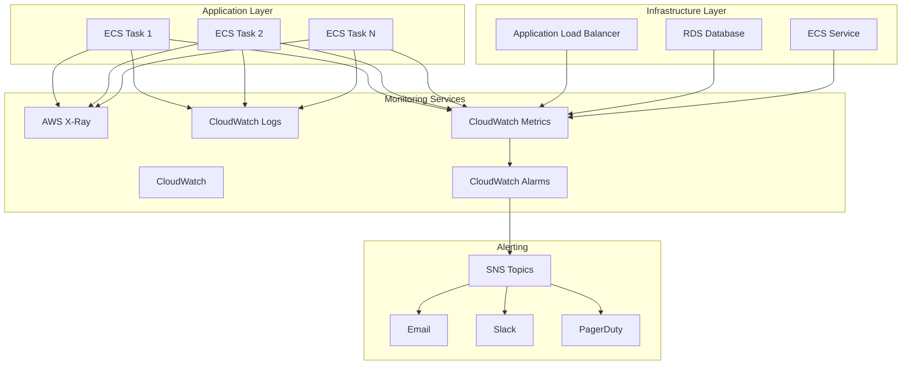

# Monitoring and Observability: Pets API

## Overview

This document describes the monitoring, logging, and observability strategy for the Pets API infrastructure.

## Monitoring Architecture



## Application Metrics

### Key Performance Indicators (KPIs)

#### Request Metrics
- **Request Count:** Total number of requests
- **Request Rate:** Requests per second
- **Response Time:** P50, P95, P99 percentiles
- **Error Rate:** Percentage of failed requests
- **Throughput:** Successful requests per second

#### Business Metrics
- **Active Users:** Number of active users
- **Pets Created:** Number of pets created
- **History Records:** Number of history records added
- **API Version Usage:** Usage by API version

### Custom Metrics

```java
// Example custom metrics (Spring Boot Actuator)
@Component
public class CustomMetrics {
    
    @Autowired
    private MeterRegistry meterRegistry;
    
    public void recordPetCreation() {
        meterRegistry.counter("pets.created").increment();
    }
    
    public void recordHistoryAddition() {
        meterRegistry.counter("history.added").increment();
    }
    
    public void recordAuthenticationFailure() {
        meterRegistry.counter("auth.failures").increment();
    }
}
```

## Infrastructure Metrics

### ECS Metrics

- **CPUUtilization:** Average CPU utilization percentage
- **MemoryUtilization:** Average memory utilization percentage
- **RunningTaskCount:** Number of running tasks
- **DesiredTaskCount:** Number of desired tasks
- **PendingTaskCount:** Number of pending tasks

### ALB Metrics

- **RequestCount:** Total number of requests
- **TargetResponseTime:** Average response time from targets
- **HTTPCode_Target_2XX_Count:** Successful responses (2xx)
- **HTTPCode_Target_4XX_Count:** Client errors (4xx)
- **HTTPCode_Target_5XX_Count:** Server errors (5xx)
- **HealthyHostCount:** Number of healthy targets
- **UnHealthyHostCount:** Number of unhealthy targets
- **ActiveConnectionCount:** Number of active connections

### RDS Metrics

- **CPUUtilization:** Average CPU utilization
- **DatabaseConnections:** Number of database connections
- **FreeableMemory:** Available memory
- **FreeStorageSpace:** Available storage space
- **ReadLatency:** Average read latency
- **WriteLatency:** Average write latency
- **ReadIOPS:** Read operations per second
- **WriteIOPS:** Write operations per second

## Logging Strategy

### Log Levels

- **ERROR:** System errors, exceptions, failures
- **WARN:** Warning conditions, deprecated features
- **INFO:** General informational messages
- **DEBUG:** Detailed debugging information (development only)

### Log Structure

```json
{
  "timestamp": "2026-01-07T20:00:00.000Z",
  "level": "INFO",
  "logger": "com.pets.api.controller.PetController",
  "message": "Pet created successfully",
  "traceId": "abc123",
  "spanId": "def456",
  "userId": "user-uuid",
  "petId": "pet-uuid",
  "duration": 45
}
```

### Log Aggregation

- **CloudWatch Logs:** Centralized log aggregation
- **Log Groups:**
  - `/ecs/pets-api` - Application logs
  - `/aws/rds/postgresql` - Database logs
  - `/aws/elasticloadbalancing` - ALB access logs

### Log Retention

- **Application Logs:** 30 days
- **Access Logs:** 90 days
- **Audit Logs:** 1 year
- **Security Logs:** 7 years (compliance)

## CloudWatch Alarms

### Critical Alarms

#### Application Health
```json
{
  "AlarmName": "pets-api-unhealthy-targets",
  "MetricName": "UnHealthyHostCount",
  "Namespace": "AWS/ApplicationELB",
  "Statistic": "Average",
  "Period": 60,
  "EvaluationPeriods": 2,
  "Threshold": 1,
  "ComparisonOperator": "GreaterThanThreshold",
  "AlarmActions": ["arn:aws:sns:REGION:ACCOUNT:critical-alerts"]
}
```

#### High Error Rate
```json
{
  "AlarmName": "pets-api-high-error-rate",
  "MetricName": "HTTPCode_Target_5XX_Count",
  "Namespace": "AWS/ApplicationELB",
  "Statistic": "Sum",
  "Period": 300,
  "EvaluationPeriods": 2,
  "Threshold": 10,
  "ComparisonOperator": "GreaterThanThreshold",
  "AlarmActions": ["arn:aws:sns:REGION:ACCOUNT:critical-alerts"]
}
```

### Warning Alarms

#### High CPU
```json
{
  "AlarmName": "pets-api-high-cpu",
  "MetricName": "CPUUtilization",
  "Namespace": "AWS/ECS",
  "Statistic": "Average",
  "Period": 300,
  "EvaluationPeriods": 2,
  "Threshold": 80,
  "ComparisonOperator": "GreaterThanThreshold",
  "AlarmActions": ["arn:aws:sns:REGION:ACCOUNT:warning-alerts"]
}
```

#### High Memory
```json
{
  "AlarmName": "pets-api-high-memory",
  "MetricName": "MemoryUtilization",
  "Namespace": "AWS/ECS",
  "Statistic": "Average",
  "Period": 300,
  "EvaluationPeriods": 2,
  "Threshold": 85,
  "ComparisonOperator": "GreaterThanThreshold",
  "AlarmActions": ["arn:aws:sns:REGION:ACCOUNT:warning-alerts"]
}
```

#### High Response Time
```json
{
  "AlarmName": "pets-api-high-response-time",
  "MetricName": "TargetResponseTime",
  "Namespace": "AWS/ApplicationELB",
  "Statistic": "Average",
  "Period": 300,
  "EvaluationPeriods": 2,
  "Threshold": 2000,
  "ComparisonOperator": "GreaterThanThreshold",
  "AlarmActions": ["arn:aws:sns:REGION:ACCOUNT:warning-alerts"]
}
```

#### Database Connections
```json
{
  "AlarmName": "pets-api-db-connections",
  "MetricName": "DatabaseConnections",
  "Namespace": "AWS/RDS",
  "Statistic": "Average",
  "Period": 300,
  "EvaluationPeriods": 2,
  "Threshold": 80,
  "ComparisonOperator": "GreaterThanThreshold",
  "AlarmActions": ["arn:aws:sns:REGION:ACCOUNT:warning-alerts"]
}
```

#### Low Storage Space
```json
{
  "AlarmName": "pets-api-low-storage",
  "MetricName": "FreeStorageSpace",
  "Namespace": "AWS/RDS",
  "Statistic": "Average",
  "Period": 300,
  "EvaluationPeriods": 1,
  "Threshold": 10000000000,
  "ComparisonOperator": "LessThanThreshold",
  "AlarmActions": ["arn:aws:sns:REGION:ACCOUNT:warning-alerts"]
}
```

## Distributed Tracing

### AWS X-Ray Integration

- **Service Map:** Visual representation of service dependencies
- **Trace Analysis:** Detailed request tracing
- **Performance Insights:** Identify bottlenecks
- **Error Analysis:** Track error patterns

### Trace Sampling

- **100% Sampling:** For errors and critical paths
- **10% Sampling:** For normal requests
- **Configurable:** Adjustable based on traffic

## Dashboards

### CloudWatch Dashboard

#### Overview Dashboard
- Request count (last 1 hour)
- Error rate (last 1 hour)
- Response time (P95, P99)
- Active tasks
- Database connections
- CPU and memory utilization

#### Performance Dashboard
- Request rate
- Response time percentiles
- Throughput
- Cache hit rate
- Database query performance

#### Infrastructure Dashboard
- ECS service health
- ALB target health
- RDS performance
- Network metrics
- Storage metrics

## Alerting Channels

### SNS Topics

- **critical-alerts:** PagerDuty integration
- **warning-alerts:** Email and Slack
- **info-alerts:** Email only

### Notification Rules

- **Critical:** Immediate notification (PagerDuty)
- **Warning:** Notification within 5 minutes
- **Info:** Daily digest

## Health Checks

### Application Health Endpoint

```
GET /actuator/health
```

Response:
```json
{
  "status": "UP",
  "components": {
    "db": {
      "status": "UP",
      "details": {
        "database": "PostgreSQL",
        "validationQuery": "isValid()"
      }
    },
    "diskSpace": {
      "status": "UP",
      "details": {
        "total": 50000000000,
        "free": 40000000000,
        "threshold": 10000000000
      }
    }
  }
}
```

### Readiness Probe

```
GET /actuator/health/readiness
```

### Liveness Probe

```
GET /actuator/health/liveness
```

## Performance Monitoring

### Key Metrics to Track

1. **Response Time:**
   - P50: Median response time
   - P95: 95th percentile
   - P99: 99th percentile

2. **Throughput:**
   - Requests per second
   - Successful requests per second

3. **Error Rate:**
   - 4xx errors (client errors)
   - 5xx errors (server errors)

4. **Resource Utilization:**
   - CPU usage
   - Memory usage
   - Database connections
   - Network I/O

### Performance Baselines

- **Response Time P95:** < 500ms
- **Response Time P99:** < 1000ms
- **Error Rate:** < 0.1%
- **CPU Utilization:** < 70% average
- **Memory Utilization:** < 80% average

## Log Analysis Queries

### CloudWatch Logs Insights

#### Error Analysis
```
fields @timestamp, @message, level
| filter level = "ERROR"
| sort @timestamp desc
| limit 100
```

#### Slow Requests
```
fields @timestamp, @message, duration
| filter duration > 1000
| sort duration desc
| limit 50
```

#### Authentication Failures
```
fields @timestamp, @message
| filter @message like /authentication.*fail/
| stats count() by bin(5m)
```

## Best Practices

1. **Structured Logging:** Use JSON format for logs
2. **Correlation IDs:** Include trace IDs in all logs
3. **Contextual Information:** Include relevant context in logs
4. **Log Levels:** Use appropriate log levels
5. **Performance Impact:** Minimize logging overhead
6. **Sensitive Data:** Never log passwords or tokens
7. **Retention Policies:** Configure appropriate retention
8. **Alert Fatigue:** Avoid too many alerts
9. **Dashboard Design:** Keep dashboards focused and actionable
10. **Regular Reviews:** Review metrics and logs regularly
