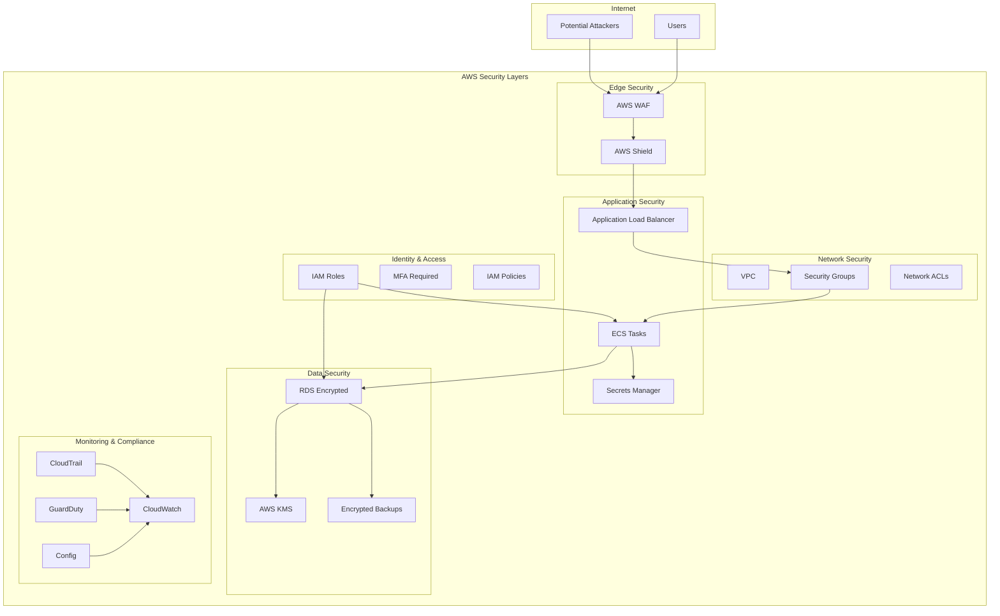

# Security Architecture: Pets API

## Security Overview

This document outlines the security architecture, policies, and best practices for the Pets API infrastructure.

## Security Architecture Diagram

## Network Security

### VPC Configuration

- **Private Subnets:** All application containers run in private subnets
- **Public Subnets:** Only ALB and NAT Gateways in public subnets
- **No Direct Internet Access:** Application containers cannot directly access internet
- **VPC Flow Logs:** Enabled for all network traffic monitoring

### Security Groups

#### ALB Security Group
- **Inbound:**
  - Port 80 (HTTP) from 0.0.0.0/0
  - Port 443 (HTTPS) from 0.0.0.0/0
- **Outbound:**
  - Port 8080 to ECS Security Group only

#### ECS Security Group
- **Inbound:**
  - Port 8080 from ALB Security Group only
- **Outbound:**
  - Port 5432 to RDS Security Group
  - Port 443 (HTTPS) to 0.0.0.0/0 (for AWS API calls)

#### RDS Security Group
- **Inbound:**
  - Port 5432 from ECS Security Group only
- **Outbound:**
  - None

### Network ACLs

- Default deny-all inbound and outbound rules
- Explicit allow rules for required traffic only
- Logging enabled for denied traffic

## Application Security

### Authentication & Authorization

- **JWT Tokens:** Secure token-based authentication
- **Password Hashing:** BCrypt with appropriate cost factor
- **Token Expiration:** Configurable token expiration
- **Role-Based Access Control:** ADMIN and USER roles

### API Security

- **HTTPS Only:** All traffic encrypted in transit
- **TLS 1.2 Minimum:** Enforced at ALB level
- **Input Validation:** All inputs validated and sanitized
- **SQL Injection Prevention:** Parameterized queries via JPA
- **XSS Protection:** Content-Type headers properly set
- **CORS Configuration:** Restricted to known origins

### Secrets Management

- **AWS Secrets Manager:** All secrets stored encrypted
- **No Hardcoded Secrets:** No secrets in code or environment variables
- **Secret Rotation:** Database passwords rotated automatically
- **Least Privilege:** IAM roles with minimal required permissions

## Data Security

### Encryption at Rest

- **RDS Encryption:** All database storage encrypted using AWS KMS
- **EBS Encryption:** All EBS volumes encrypted
- **S3 Encryption:** All S3 buckets encrypted
- **Backup Encryption:** All backups encrypted

### Encryption in Transit

- **TLS/SSL:** All external communication encrypted
- **Database Connections:** SSL/TLS for database connections
- **Internal Communication:** VPC provides network isolation

### Database Security

- **Connection Encryption:** SSL required for database connections
- **Parameterized Queries:** Prevents SQL injection
- **Least Privilege:** Database user with minimal required permissions
- **Audit Logging:** Database audit logs enabled

## Identity and Access Management

### IAM Principles

- **Least Privilege:** Minimum permissions required
- **Role-Based Access:** IAM roles for services, not users
- **No Long-Term Credentials:** No access keys in code
- **MFA Required:** Multi-factor authentication for console access

### IAM Roles

#### ECS Task Execution Role
- ECR image pull permissions
- CloudWatch Logs write permissions
- Secrets Manager read permissions

#### ECS Task Role
- Secrets Manager read permissions
- No other permissions (stateless application)

#### RDS Access
- Database credentials stored in Secrets Manager
- No direct IAM database authentication

## Monitoring and Logging

### CloudTrail

- **API Logging:** All AWS API calls logged
- **Log Retention:** 90 days minimum
- **Log Integrity:** Log file validation enabled
- **Alerts:** Unauthorized API access alerts

### CloudWatch

- **Application Logs:** All application logs in CloudWatch
- **Metrics:** CPU, memory, request count, error rates
- **Alarms:** Automated alerts for anomalies
- **Log Retention:** 30 days for application logs

### GuardDuty

- **Threat Detection:** Enabled for VPC Flow Logs
- **DNS Logs:** DNS query logging enabled
- **CloudTrail Integration:** Analyzes API calls for threats

### AWS Config

- **Compliance Monitoring:** Continuous compliance checking
- **Configuration History:** Track configuration changes
- **Remediation:** Automated remediation for non-compliance

## Compliance

### Data Protection

- **GDPR Compliance:** Data protection measures in place
- **Data Retention:** Configurable retention policies
- **Data Deletion:** Secure data deletion procedures
- **Right to Access:** Audit logs enable data access tracking

### Audit Requirements

- **Access Logs:** All access logged and retained
- **Change Logs:** All configuration changes logged
- **Security Events:** Security events tracked and alerted
- **Regular Audits:** Quarterly security audits

## Vulnerability Management

### Container Security

- **Image Scanning:** ECR image scanning on push
- **Base Image Updates:** Regular base image updates
- **Dependency Scanning:** Maven dependency vulnerability scanning
- **No Root User:** Containers run as non-root user

### Patch Management

- **Automated Updates:** Security patches applied automatically
- **Update Testing:** Updates tested in staging before production
- **Rollback Plan:** Ability to rollback problematic updates
- **Emergency Patches:** Process for critical security patches

## Incident Response

### Detection

- **Automated Alerts:** CloudWatch alarms for security events
- **GuardDuty Findings:** Automated threat detection
- **Log Analysis:** Regular log analysis for anomalies
- **Penetration Testing:** Regular security testing

### Response Procedures

1. **Detection:** Identify security incident
2. **Containment:** Isolate affected resources
3. **Investigation:** Analyze incident scope
4. **Remediation:** Fix vulnerabilities
5. **Recovery:** Restore normal operations
6. **Post-Mortem:** Document lessons learned

## Security Best Practices

### Development

- **Secure Coding:** Follow OWASP Top 10 guidelines
- **Code Reviews:** Security-focused code reviews
- **Dependency Management:** Regular dependency updates
- **Secret Scanning:** No secrets in code repositories

### Operations

- **Regular Updates:** Keep all components updated
- **Backup Testing:** Regular backup restoration testing
- **Access Reviews:** Quarterly access reviews
- **Security Training:** Regular security training for team

### Infrastructure

- **Defense in Depth:** Multiple security layers
- **Fail Secure:** Default deny, explicit allow
- **Principle of Least Privilege:** Minimum required access
- **Separation of Duties:** Different roles for different tasks

## Security Checklist

### Initial Setup

- [ ] VPC configured with private subnets
- [ ] Security groups configured with least privilege
- [ ] RDS encryption enabled
- [ ] Secrets stored in Secrets Manager
- [ ] IAM roles with least privilege
- [ ] CloudTrail enabled
- [ ] GuardDuty enabled
- [ ] CloudWatch alarms configured
- [ ] SSL certificate configured
- [ ] WAF rules configured (if applicable)

### Ongoing Maintenance

- [ ] Regular security updates applied
- [ ] Access reviews conducted quarterly
- [ ] Security logs reviewed regularly
- [ ] Penetration testing conducted annually
- [ ] Backup restoration tested quarterly
- [ ] Incident response plan tested annually
- [ ] Security training conducted regularly

## Security Contacts

- **Security Team:** security@example.com
- **On-Call:** +1-XXX-XXX-XXXX
- **Incident Response:** incident@example.com
