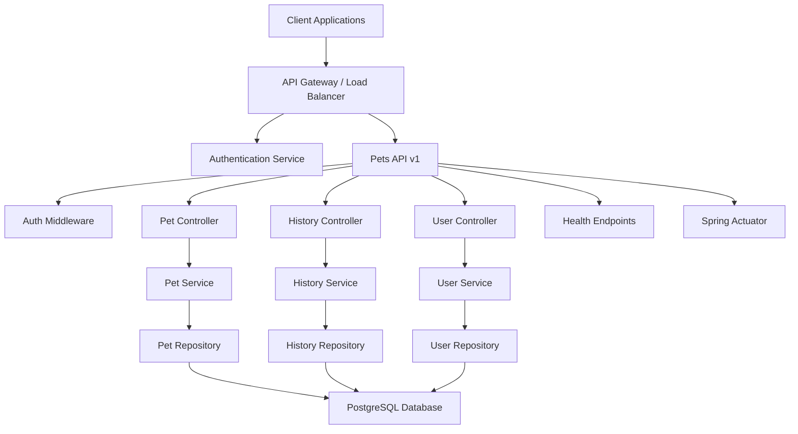
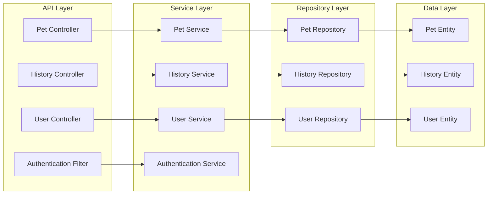
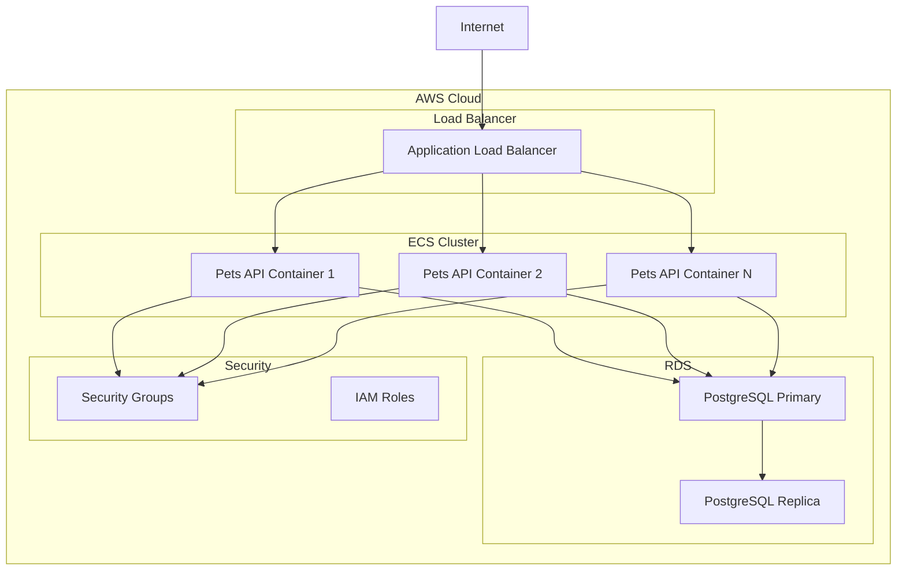
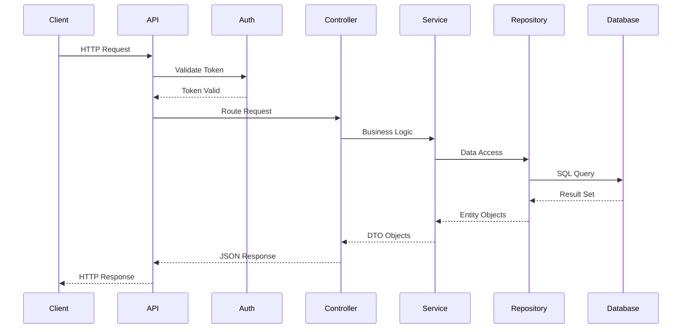

# High Level Architecture: Pets API

## Architecture Overview

The Pets API follows a microservices architecture pattern built on Spring Boot 3, providing a RESTful interface for pet management with authentication and versioning support.

## System Architecture Diagram

## Component Diagram

## Deployment Architecture

## Data Flow Diagram

## Technology Stack

### Application Layer
- **Framework**: Spring Boot 3
- **Language**: Java
- **Build Tool**: Maven
- **API Style**: RESTful

### Data Layer
- **Database**: PostgreSQL
- **ORM**: Spring Data JPA
- **Migrations**: Flyway or Liquibase

### Security
- **Authentication**: Spring Security
- **Token**: JWT (JSON Web Tokens)
- **Password**: BCrypt

### Infrastructure
- **Containerization**: Docker
- **Orchestration**: Docker Compose (local), ECS (AWS)
- **Cloud Provider**: AWS
- **CI/CD**: GitHub Actions

### Monitoring & Health
- **Health Checks**: Spring Actuator
- **Metrics**: Actuator Metrics
- **Logging**: SLF4J with Logback

## API Structure

### Versioning Strategy
- URL-based versioning: `/api/v1/...`
- Future versions: `/api/v2/...`

### Endpoint Categories

1. **Authentication Endpoints** (`/api/v1/auth`)
   - POST `/login` - User login
   - POST `/register` - User registration
   - POST `/logout` - User logout

2. **User Endpoints** (`/api/v1/users`)
   - GET `/users` - List users (admin only)
   - GET `/users/{id}` - Get user by ID
   - PUT `/users/{id}` - Update user
   - DELETE `/users/{id}` - Delete user

3. **Pet Endpoints** (`/api/v1/pets`)
   - GET `/pets` - List pets
   - GET `/pets/{id}` - Get pet by ID
   - POST `/pets` - Create pet
   - PUT `/pets/{id}` - Update pet
   - DELETE `/pets/{id}` - Soft delete pet

4. **History Endpoints** (`/api/v1/pets/{petId}/history`)
   - GET `/pets/{petId}/history` - Get pet history
   - POST `/pets/{petId}/history` - Add history record
   - PUT `/pets/{petId}/history/{id}` - Update history record
   - DELETE `/pets/{petId}/history/{id}` - Delete history record

5. **Health Endpoints** (`/actuator`)
   - GET `/health` - Health check
   - GET `/info` - Application info

## Data Model

### Core Entities

1. **User**
   - id (UUID)
   - username (String, unique)
   - email (String, unique)
   - password (String, hashed)
   - role (Enum: ADMIN, USER)
   - createdAt (Timestamp)
   - updatedAt (Timestamp)

2. **Pet**
   - id (UUID)
   - name (String)
   - adoptionDate (Date)
   - birthDate (Date)
   - race (String)
   - breed (String)
   - dateOfDeath (Date, nullable)
   - deleted (Boolean, default: false)
   - deletedAt (Timestamp, nullable)
   - createdAt (Timestamp)
   - updatedAt (Timestamp)
   - userId (UUID, Foreign Key)

3. **PetHistory**
   - id (UUID)
   - petId (UUID, Foreign Key)
   - date (Date)
   - description (String)
   - createdAt (Timestamp)
   - updatedAt (Timestamp)

## Security Architecture

### Authentication Flow
1. Client sends credentials to `/api/v1/auth/login`
2. Server validates credentials
3. Server generates JWT token
4. Client includes token in Authorization header for subsequent requests
5. Server validates token on each request

### Authorization
- Role-based access control (RBAC)
- Admin users can manage other users
- Users can only manage their own pets
- All endpoints require valid authentication

## Scalability Considerations

- Horizontal scaling via container orchestration
- Database read replicas for read-heavy workloads
- Connection pooling for database connections
- Caching strategy for frequently accessed data
- Stateless API design for load balancing

## Resilience Patterns

- Health checks for container orchestration
- Database connection retry logic
- Graceful error handling
- Proper HTTP status codes
- Transaction management for data consistency
