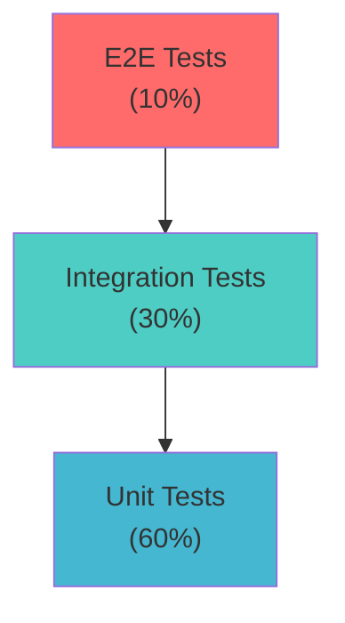

# Test Strategy: Pets API

## Overview

This document outlines the comprehensive test strategy for the Pets API, a RESTful Spring Boot application for pet management. The strategy covers all testing levels from unit to end-to-end testing, ensuring quality, reliability, and security.

## Testing Pyramid



## Test Levels

### 1. Unit Tests (60%)

**Purpose:** Test individual components in isolation

**Coverage:**
- Controllers (request/response handling, validation)
- Services (business logic, data transformation)
- Mappers (DTO conversions)
- Security components (JWT token generation/validation, password encoding)
- Exception handlers (error response formatting)

**Tools:**
- JUnit 5
- Mockito
- AssertJ
- Spring Test (MockMvc for controllers)

**Status:** ✅ Implemented
- `AuthControllerTest`
- `PetControllerTest`
- `UserControllerTest`
- `PetHistoryControllerTest`
- Service layer tests
- Security component tests

**Coverage Target:** 80%+ code coverage

---

### 2. Integration Tests (30%)

**Purpose:** Test component interactions with real dependencies

**Coverage:**
- Database operations (JPA repositories, Flyway migrations)
- Redis operations (token blacklist, rate limiting)
- Security filter chain (JWT authentication, authorization)
- End-to-end request/response flow within application boundaries
- Cross-cutting concerns (validation, error handling)

**Tools:**
- Spring Boot Test
- TestContainers (PostgreSQL, Redis)
- @SpringBootTest with @AutoConfigureMockMvc
- H2 Database (for lightweight tests)

**Test Scenarios:**

#### Authentication Integration Tests
- User registration with database persistence
- Login with JWT token generation
- Logout with token revocation (Redis blacklist)
- Token validation and expiration
- Password encoding and verification

#### Pet Management Integration Tests
- Create pet with user association
- List pets with pagination and filtering
- Update pet with authorization checks
- Soft delete pet
- Access control (users see only their pets, admins see all)

#### Pet History Integration Tests
- Create history record linked to pet
- List history with pagination and sorting
- Update/delete history with authorization
- Cascade operations

#### User Management Integration Tests (Admin)
- Admin-only endpoints authorization
- User CRUD operations
- Role-based access control

**Status:** ⚠️ Partial (needs expansion)

---

### 3. End-to-End Tests (10%)

**Purpose:** Test complete user workflows through the API

**Coverage:**
- Complete user journeys
- Multi-step workflows
- Cross-endpoint scenarios
- Real HTTP requests/responses
- Authentication flow end-to-end

**Tools:**
- REST Assured
- TestContainers (full stack)
- Spring Boot Test (@SpringBootTest with webEnvironment)

**Test Scenarios:**

#### User Registration and Authentication Flow
1. Register new user
2. Login with credentials
3. Access protected endpoint
4. Logout
5. Verify token is invalidated

#### Pet Management Workflow
1. Register and login
2. Create multiple pets
3. List pets with pagination
4. Update pet information
5. Add history records
6. View pet history
7. Delete pet (soft delete)
8. Verify deleted pet excluded from default queries

#### Admin Workflow
1. Login as admin
2. List all users
3. View user details
4. Update user role
5. Access all pets (cross-user)
6. Manage pet history for any pet

#### Authorization and Security Flow
1. Register regular user
2. Create pet
3. Attempt to access another user's pet (should fail)
4. Login as admin
5. Access any pet (should succeed)
6. Verify rate limiting
7. Verify token expiration

**Status:** ❌ Not implemented (needs creation)

---

## Test Categories

### Functional Tests

**Authentication**
- ✅ User registration (valid/invalid inputs)
- ✅ User login (valid/invalid credentials)
- ✅ Token generation and validation
- ✅ Token revocation (logout)
- ✅ Password validation rules

**Pet Management**
- ✅ Create pet (with validation)
- ✅ List pets (pagination, filtering, sorting)
- ✅ Get pet by ID
- ✅ Update pet
- ✅ Soft delete pet
- ✅ Access control (user vs admin)

**Pet History**
- ✅ Create history record
- ✅ List history (pagination, sorting)
- ✅ Update history
- ✅ Delete history
- ✅ Access control

**User Management (Admin)**
- ✅ List users
- ✅ Get user by ID
- ✅ Update user
- ✅ Delete user
- ✅ Admin-only access

### Non-Functional Tests

#### Performance Tests
- Response time targets:
  - Authentication endpoints: < 200ms
  - CRUD operations: < 300ms
  - List operations (paginated): < 500ms
- Load testing scenarios:
  - 100 concurrent users
  - 1000 requests/minute per endpoint
- Database query performance
- Redis operation performance

#### Security Tests
- ✅ Authentication bypass attempts
- ✅ Authorization checks (role-based access)
- ✅ JWT token tampering
- ✅ SQL injection attempts
- ✅ XSS prevention
- ✅ CSRF protection
- ✅ Rate limiting enforcement
- ✅ Token expiration handling
- ✅ Password strength validation
- ✅ Input validation and sanitization

#### Reliability Tests
- Database connection failures
- Redis connection failures
- Concurrent request handling
- Transaction rollback scenarios
- Error recovery mechanisms

#### Compatibility Tests
- API version compatibility
- Database migration compatibility
- Different client implementations

---

## Test Data Management

### Test Data Strategy
- **Isolated test data:** Each test creates its own data
- **Test fixtures:** Reusable test data builders
- **Database cleanup:** @Transactional rollback or explicit cleanup
- **Test containers:** Fresh database per test suite

### Test Data Builders
- `UserTestBuilder` - Create test users
- `PetTestBuilder` - Create test pets
- `PetHistoryTestBuilder` - Create test history records

---

## Test Environment Setup

### Required Services
- PostgreSQL (TestContainers)
- Redis (TestContainers)
- Spring Boot application context

### Configuration
- Test profile: `application-test.yml`
- Separate test database
- Mock external services (if any)

---

## Test Execution Strategy

### Pre-Commit (Local Development)
- Unit tests (fast feedback)
- Quick integration tests

### Continuous Integration (CI)
- All unit tests
- All integration tests
- Code coverage report
- Test execution time: < 10 minutes

### Pre-Production
- Full test suite (unit + integration + E2E)
- Performance tests
- Security tests
- Test execution time: < 30 minutes

### Production Monitoring
- Health check monitoring
- Error rate monitoring
- Performance metrics

---

## Test Coverage Goals

| Component | Target Coverage |
|-----------|----------------|
| Controllers | 90%+ |
| Services | 85%+ |
| Repositories | 80%+ |
| Security | 90%+ |
| Mappers | 95%+ |
| Exception Handlers | 85%+ |
| **Overall** | **80%+** |

---

## Test Automation Framework

### Structure
```
src/test/java/com/pets/api/
├── unit/              # Unit tests (existing)
│   ├── controller/
│   ├── service/
│   └── security/
├── integration/       # Integration tests
│   ├── auth/
│   ├── pets/
│   ├── history/
│   └── users/
└── e2e/              # End-to-end tests
    ├── workflows/
    └── scenarios/
```

### Test Utilities
- `TestContainersConfig` - Container setup
- `TestDataFactory` - Test data creation
- `ApiTestClient` - REST client wrapper
- `AuthHelper` - Authentication utilities

---

## Risk-Based Testing

### High-Risk Areas (Priority 1)
1. **Authentication & Authorization**
   - Token generation/validation
   - Role-based access control
   - Password security

2. **Data Access Control**
   - User isolation (users see only their pets)
   - Admin privileges
   - Soft delete behavior

3. **Security**
   - Rate limiting
   - Input validation
   - SQL injection prevention

### Medium-Risk Areas (Priority 2)
1. **Data Integrity**
   - Pet history relationships
   - Cascade operations
   - Transaction handling

2. **Performance**
   - Pagination efficiency
   - Database query optimization
   - Redis caching

### Low-Risk Areas (Priority 3)
1. **Documentation**
   - API documentation accuracy
   - Error message clarity

---

## Test Metrics and Reporting

### Metrics to Track
- Test execution time
- Test pass/fail rate
- Code coverage percentage
- Defect detection rate
- Test maintenance effort

### Reporting
- JUnit test reports
- JaCoCo coverage reports
- Allure test reports (optional)

---

## Continuous Improvement

### Test Review Process
- Regular test strategy reviews
- Test coverage analysis
- Test effectiveness evaluation
- Test maintenance backlog

### Test Refactoring
- Remove redundant tests
- Optimize slow tests
- Improve test readability
- Enhance test data management

---

## Test Maintenance

### Guidelines
- Keep tests independent and isolated
- Use descriptive test names
- Follow AAA pattern (Arrange, Act, Assert)
- Avoid test interdependencies
- Clean up test data properly
- Document complex test scenarios

### Test Code Quality
- Follow same coding standards as production code
- Regular code reviews for tests
- Refactor tests when production code changes
- Keep test code DRY (Don't Repeat Yourself)

---

## Appendix

### Test Tools Summary

| Tool | Purpose | Version |
|------|---------|---------|
| JUnit 5 | Test framework | 5.x |
| Mockito | Mocking framework | 5.x |
| AssertJ | Assertions | 3.x |
| Spring Boot Test | Integration testing | 3.2.0 |
| TestContainers | Containerized testing | Latest |
| REST Assured | API testing | Latest |
| H2 Database | In-memory DB for tests | Latest |

### References
- [API Design Documentation](../architecture/api_design.md)
- [User Stories](../pm/User%20Stories.md)
- [Security Documentation](../infrastructure/security.md)
