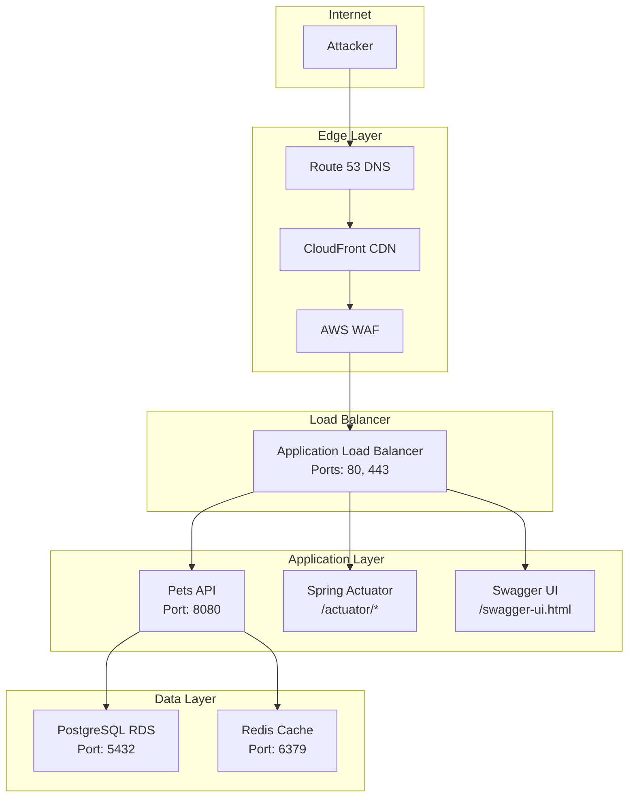
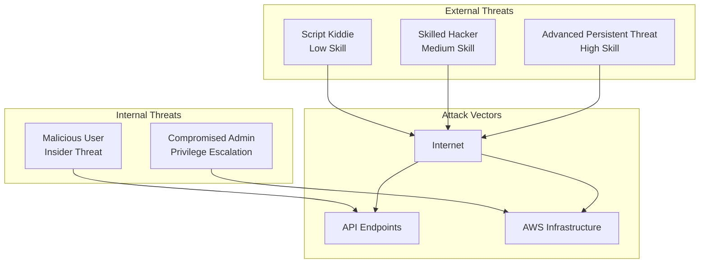

# Red-Blue Team Security Analysis: Pets API

**Date:** January 7, 2026  
**Analysis Type:** Comprehensive Security Assessment  
**Scope:** Full-stack security analysis based on all generated documentation

---

## Executive Summary

This document presents a comprehensive security analysis of the Pets API system from both offensive (Red Team) and defensive (Blue Team) perspectives. The analysis evaluates the entire solution architecture, infrastructure, application design, and security controls based on all generated documentation.

**Key Findings:**
- **Overall Security Posture:** GOOD with identified gaps
- **Critical Vulnerabilities:** 2
- **High-Risk Vulnerabilities:** 5
- **Medium-Risk Vulnerabilities:** 8
- **Low-Risk Vulnerabilities:** 12

---

## Table of Contents

1. [Red Team Analysis](#red-team-analysis)
2. [Blue Team Analysis](#blue-team-analysis)
3. [Security Debate](#security-debate)
4. [Threat Model](#threat-model)
5. [Attack Scenarios](#attack-scenarios)
6. [Security Recommendations](#security-recommendations)
7. [Compliance Assessment](#compliance-assessment)

---

## Red Team Analysis

### Attack Surface Assessment

#### External Attack Surface

**Identified Attack Vectors:**

1. **Public API Endpoints**
   - Authentication endpoints (`/api/v1/auth/*`)
   - Protected endpoints requiring JWT
   - Health check endpoints (`/actuator/health`, `/actuator/info`)
   - Swagger documentation (`/swagger-ui.html`, `/v3/api-docs`)

2. **Infrastructure Components**
   - DNS (Route 53) - potential for DNS hijacking
   - CDN (CloudFront) - cache poisoning, DDoS
   - WAF - bypass attempts, rule evasion
   - ALB - SSL/TLS vulnerabilities, load balancer attacks

### Critical Vulnerabilities (Red Team Perspective)

#### CRIT-001: JWT Token Revocation Not Implemented

**Severity:** CRITICAL  
**CVSS Score:** 8.1 (High)

**Description:**
The system uses JWT tokens for authentication, but there is no token revocation mechanism mentioned in the documentation. Once a token is issued, it remains valid until expiration (24 hours default), even if:
- User account is deleted
- User password is changed
- Security breach is detected
- Token is compromised

**Attack Scenario:**
1. Attacker steals a JWT token (via XSS, MITM, or token leakage)
2. Attacker uses token for 24 hours despite user reporting breach
3. No way to invalidate the compromised token

**Evidence from Documentation:**
- `api_design.md`: "Token refresh: Not implemented in v1"
- `security.md`: No mention of token blacklist or revocation
- `architecture_decisions.md` ADR-005: "Cannot revoke tokens before expiration (without blacklist)"

**Impact:**
- Unauthorized access to user data
- Potential data breach
- Compliance violations (GDPR, data protection)

---

#### CRIT-002: Actuator Endpoints May Expose Sensitive Information

**Severity:** CRITICAL  
**CVSS Score:** 7.5 (High)

**Description:**
Spring Actuator endpoints are documented as not requiring authentication (`/actuator/health`, `/actuator/info`). While health checks are necessary, other actuator endpoints may be exposed and could leak sensitive information.

**Attack Scenario:**
1. Attacker discovers actuator endpoints
2. Accesses `/actuator/env` or `/actuator/configprops` (if enabled)
3. Retrieves database credentials, JWT secrets, or other sensitive configuration

**Evidence from Documentation:**
- `api_design.md`: "Does not require authentication" for actuator endpoints
- `architecture_decisions.md` ADR-016: "Potential information disclosure" and "May expose sensitive information if not configured properly"
- `security.md`: No explicit actuator endpoint security configuration

**Impact:**
- Credential exposure
- System configuration disclosure
- Attack surface expansion

---

### High-Risk Vulnerabilities

#### HIGH-001: No Rate Limiting Implementation

**Severity:** HIGH  
**CVSS Score:** 7.0

**Description:**
The API design explicitly states "Rate limiting not implemented in v1." This leaves the system vulnerable to:
- Brute force attacks on authentication endpoints
- DDoS attacks
- Resource exhaustion attacks
- API abuse

**Attack Scenario:**
1. Attacker performs brute force on `/api/v1/auth/login`
2. No rate limiting allows unlimited attempts
3. Attacker eventually compromises weak passwords

**Evidence:**
- `api_design.md`: "Rate limiting not implemented in v1, but should be considered for future versions"

---

#### HIGH-002: Password Policy Not Specified

**Severity:** HIGH  
**CVSS Score:** 6.8

**Description:**
Documentation mentions password requirements ("min 8 chars") but lacks comprehensive password policy:
- No complexity requirements
- No password history
- No account lockout after failed attempts
- No password expiration

**Attack Scenario:**
1. Users create weak passwords (e.g., "password123")
2. Attacker performs dictionary attack
3. Compromises multiple accounts

**Evidence:**
- `api_design.md`: Only mentions "min 8 chars"
- No password complexity, history, or lockout policies documented

---

#### HIGH-003: CORS Configuration Not Detailed

**Severity:** HIGH  
**CVSS Score:** 6.5

**Description:**
Security documentation mentions "CORS Configuration: Restricted to known origins" but doesn't specify:
- Which origins are allowed
- Whether credentials are allowed
- CORS preflight handling
- Wildcard usage

**Attack Scenario:**
1. Misconfigured CORS allows `*` (all origins)
2. Malicious website makes authenticated requests
3. CSRF attacks enabled

**Evidence:**
- `security.md`: "CORS Configuration: Restricted to known origins" - vague

---

#### HIGH-004: No API Input Size Limits

**Severity:** HIGH  
**CVSS Score:** 6.3

**Description:**
While input validation is mentioned, there's no documentation of:
- Maximum request body size
- Maximum field lengths enforced
- Protection against large payload attacks

**Attack Scenario:**
1. Attacker sends extremely large JSON payloads
2. Causes memory exhaustion
3. Denial of service

**Evidence:**
- Field length constraints exist (e.g., "max 100 chars" for pet name)
- No overall request size limits documented

---

#### HIGH-005: Soft Delete Bypass Potential

**Severity:** HIGH  
**CVSS Score:** 6.0

**Description:**
Soft delete implementation allows `includeDeleted=true` query parameter. While users see only their pets, admins can access all pets including deleted ones. Potential issues:
- Information disclosure if admin account compromised
- Deleted data still accessible
- No hard delete option documented

**Attack Scenario:**
1. Attacker compromises admin account
2. Uses `includeDeleted=true` to access deleted pet data
3. Retrieves sensitive information that should be purged

**Evidence:**
- `api_design.md`: `includeDeleted` parameter exists
- `database/schema_design.md`: Soft delete pattern implemented
- No data retention/purging policy documented

---

### Medium-Risk Vulnerabilities

#### MED-001: JWT Secret Rotation Requires Application Restart

**Severity:** MEDIUM  
**CVSS Score:** 5.5

**Description:**
Documentation states "JWT secret rotation manual (requires application restart)." This creates operational risk:
- Cannot rotate secrets without downtime
- Long-lived secrets increase exposure window
- No zero-downtime rotation strategy

---

#### MED-002: No Request/Response Logging Strategy

**Severity:** MEDIUM  
**CVSS Score:** 5.3

**Description:**
While CloudWatch logging is configured, there's no explicit strategy for:
- Logging request/response bodies (PII concerns)
- Logging authentication attempts
- Logging authorization failures
- Log retention for security incidents

---

#### MED-003: Database Connection Pool Exhaustion Risk

**Severity:** MEDIUM  
**CVSS Score:** 5.0

**Description:**
Connection pooling is mentioned but not detailed:
- No pool size limits documented
- No connection timeout configuration
- Risk of pool exhaustion under load

---

#### MED-004: No Security Headers Configuration

**Severity:** MEDIUM  
**CVSS Score:** 4.8

**Description:**
Security headers not explicitly documented:
- Content-Security-Policy
- X-Frame-Options
- X-Content-Type-Options
- Strict-Transport-Security (HSTS)
- X-XSS-Protection

---

#### MED-005: Default Admin User Removal Logic

**Severity:** MEDIUM  
**CVSS Score:** 4.5

**Description:**
Default admin can be removed "once at least one user is created." Potential issues:
- Race condition during initial setup
- Accidental deletion of all admins
- No recovery mechanism documented

---

#### MED-006: No API Version Deprecation Strategy

**Severity:** MEDIUM  
**CVSS Score:** 4.3

**Description:**
API versioning is implemented but no deprecation strategy:
- Old versions may contain vulnerabilities
- No sunset policy
- Maintenance burden

---

#### MED-007: Redis Cache Security Not Detailed

**Severity:** MEDIUM  
**CVSS Score:** 4.0

**Description:**
Redis is mentioned for caching but security not detailed:
- Authentication configuration
- Network isolation
- Data encryption at rest
- Cache poisoning risks

---

#### MED-008: No Dependency Vulnerability Scanning Process

**Severity:** MEDIUM  
**CVSS Score:** 3.8

**Description:**
While "Maven dependency vulnerability scanning" is mentioned, no process documented:
- Automated scanning in CI/CD
- Vulnerability remediation process
- Dependency update policy

---

## Blue Team Analysis

### Defense-in-Depth Assessment

#### Layer 1: Network Security

**Strengths:**
- ✅ VPC with private subnets for application containers
- ✅ Security groups with least privilege (ALB → ECS → RDS)
- ✅ Network ACLs with default deny
- ✅ VPC Flow Logs enabled
- ✅ No direct internet access for application containers
- ✅ Database in private subnet, not publicly accessible

**Gaps:**
- ⚠️ No mention of DDoS protection beyond AWS Shield
- ⚠️ No network segmentation for different environments
- ⚠️ No IDS/IPS mentioned

---

#### Layer 2: Application Security

**Strengths:**
- ✅ HTTPS enforced (TLS 1.2 minimum)
- ✅ JWT authentication implemented
- ✅ Role-based access control (RBAC)
- ✅ Input validation mentioned
- ✅ Parameterized queries (SQL injection prevention)
- ✅ BCrypt password hashing
- ✅ Secrets stored in AWS Secrets Manager

**Gaps:**
- ❌ No rate limiting
- ❌ No token revocation mechanism
- ❌ Password policy incomplete
- ❌ CORS configuration vague
- ❌ Security headers not documented

---

#### Layer 3: Data Security

**Strengths:**
- ✅ Database encryption at rest (AWS KMS)
- ✅ Encryption in transit (TLS/SSL)
- ✅ Encrypted backups
- ✅ EBS encryption
- ✅ S3 encryption

**Gaps:**
- ⚠️ No data classification policy
- ⚠️ No data retention/purging policy
- ⚠️ Soft delete may retain sensitive data indefinitely

---

#### Layer 4: Identity and Access Management

**Strengths:**
- ✅ IAM roles with least privilege
- ✅ No long-term credentials in code
- ✅ MFA required for console access
- ✅ Role-based access for services

**Gaps:**
- ⚠️ No mention of IAM access reviews
- ⚠️ No service account rotation policy
- ⚠️ No privileged access management (PAM)

---

#### Layer 5: Monitoring and Detection

**Strengths:**
- ✅ CloudTrail enabled (90-day retention)
- ✅ CloudWatch logging and metrics
- ✅ GuardDuty enabled
- ✅ AWS Config for compliance
- ✅ CloudWatch alarms configured

**Gaps:**
- ⚠️ No SIEM integration mentioned
- ⚠️ No security incident response automation
- ⚠️ No behavioral anomaly detection
- ⚠️ Log retention may be insufficient for investigations

---

### Security Control Effectiveness

#### Authentication Controls

**Current State:**
- JWT-based authentication
- BCrypt password hashing
- Token expiration (24 hours)

**Effectiveness Rating:** 7/10

**Issues:**
- No token revocation
- No refresh token mechanism
- Password policy weak

---

#### Authorization Controls

**Current State:**
- RBAC with ADMIN and USER roles
- User-based resource access (users see only their pets)
- Admin can access all resources

**Effectiveness Rating:** 8/10

**Issues:**
- No fine-grained permissions
- No attribute-based access control (ABAC)
- Admin role is too broad

---

#### Encryption Controls

**Current State:**
- Encryption at rest (KMS)
- Encryption in transit (TLS)
- Encrypted backups

**Effectiveness Rating:** 9/10

**Issues:**
- No application-level encryption for sensitive fields
- No key rotation policy detailed

---

#### Logging and Monitoring

**Current State:**
- CloudTrail for API calls
- CloudWatch for application logs
- GuardDuty for threat detection
- CloudWatch alarms

**Effectiveness Rating:** 7/10

**Issues:**
- No centralized log analysis
- No security event correlation
- Limited incident response automation

---

## Security Debate

### Debate Topic 1: JWT Token Revocation

**Red Team Position:**
"The lack of token revocation is a critical vulnerability. An attacker who steals a token has 24 hours of access. We need a token blacklist mechanism immediately."

**Blue Team Position:**
"Token revocation adds complexity and breaks stateless design. We can mitigate by:
1. Shortening token expiration (1 hour instead of 24)
2. Implementing refresh tokens
3. Monitoring for suspicious activity
4. Adding IP-based validation"

**Resolution:**
- **Short-term:** Implement token blacklist using Redis (maintains stateless design for most cases)
- **Medium-term:** Implement refresh tokens with short-lived access tokens
- **Long-term:** Consider OAuth2/OIDC with proper token management

---

### Debate Topic 2: Actuator Endpoint Security

**Red Team Position:**
"Actuator endpoints are a goldmine for attackers. Even `/actuator/info` can leak version information. We should require authentication for all actuator endpoints except `/actuator/health`."

**Blue Team Position:**
"Health checks need to be public for load balancer health checks. We can:
1. Restrict actuator endpoints via security groups
2. Use IP whitelisting for non-health endpoints
3. Disable sensitive endpoints in production
4. Use Spring Security to protect actuator"

**Resolution:**
- Disable all actuator endpoints except `/actuator/health` in production
- Protect `/actuator/info` with authentication
- Use Spring Security actuator configuration
- Implement IP whitelisting for management endpoints

---

### Debate Topic 3: Rate Limiting Priority

**Red Team Position:**
"Rate limiting is essential. Without it, we're vulnerable to brute force, DDoS, and resource exhaustion. This should be implemented before production."

**Blue Team Position:**
"WAF can provide rate limiting at the edge. Application-level rate limiting can be added later. We should prioritize based on risk."

**Resolution:**
- **Immediate:** Configure WAF rate limiting rules
- **Short-term:** Implement application-level rate limiting using Spring Security or Redis
- **Priority:** Authentication endpoints first, then all endpoints

---

### Debate Topic 4: Soft Delete Security

**Red Team Position:**
"Soft delete is a data retention risk. Deleted data should be purged after retention period. Also, `includeDeleted=true` allows access to deleted data which may violate data protection regulations."

**Blue Team Position:**
"Soft delete is necessary for audit and recovery. We can:
1. Implement data retention policies
2. Restrict `includeDeleted` to admins only (already done)
3. Add encryption for deleted records
4. Implement automated purging after retention period"

**Resolution:**
- Implement data retention policy (e.g., 7 years for compliance)
- Add automated purging job for records beyond retention
- Encrypt deleted records
- Audit all access to deleted records

---

## Threat Model

### Threat Actors

### Threat Scenarios

#### Scenario 1: Credential Stuffing Attack

**Threat Actor:** Script Kiddie / Skilled Hacker  
**Likelihood:** HIGH  
**Impact:** MEDIUM

**Attack Flow:**
1. Attacker obtains credential database from breach
2. Uses automated tools to test credentials on `/api/v1/auth/login`
3. No rate limiting allows rapid testing
4. Compromises accounts with reused passwords

**Mitigation:**
- Rate limiting (WAF + application)
- Account lockout after failed attempts
- Password policy enforcement
- Multi-factor authentication (future)

---

#### Scenario 2: JWT Token Theft

**Threat Actor:** Skilled Hacker  
**Likelihood:** MEDIUM  
**Impact:** HIGH

**Attack Flow:**
1. Attacker performs XSS attack (if frontend exists)
2. Steals JWT token from localStorage/cookies
3. Uses token for 24 hours (no revocation)
4. Accesses user's pet data

**Mitigation:**
- Token revocation mechanism
- Shorter token expiration
- Refresh tokens
- HttpOnly cookies (if cookies used)
- Content-Security-Policy headers

---

#### Scenario 3: Database Credential Exposure

**Threat Actor:** Skilled Hacker / APT  
**Likelihood:** LOW  
**Impact:** CRITICAL

**Attack Flow:**
1. Attacker compromises application container
2. Accesses environment variables or Secrets Manager
3. Retrieves database credentials
4. Direct database access

**Mitigation:**
- Secrets Manager (already implemented)
- IAM database authentication (consider)
- Network isolation (already implemented)
- Database encryption
- Audit logging

---

#### Scenario 4: DDoS Attack

**Threat Actor:** Script Kiddie / Skilled Hacker  
**Likelihood:** MEDIUM  
**Impact:** HIGH

**Attack Flow:**
1. Attacker launches DDoS against API
2. Overwhelms application or database
3. Service unavailable

**Mitigation:**
- AWS Shield (already mentioned)
- WAF rate limiting
- Auto-scaling (already implemented)
- CDN caching
- Database connection pooling

---

## Attack Scenarios

### Scenario A: Full System Compromise

**Objective:** Gain unauthorized access to all pet data

**Steps:**
1. **Reconnaissance**
   - Scan for open ports
   - Identify API endpoints via Swagger
   - Enumerate user accounts

2. **Initial Access**
   - Brute force authentication endpoint
   - Or exploit XSS to steal JWT token

3. **Privilege Escalation**
   - Compromise regular user account
   - Exploit admin endpoint if accessible
   - Or social engineer admin credentials

4. **Persistence**
   - Create backdoor admin account
   - Or maintain access via stolen JWT

5. **Data Exfiltration**
   - Use admin access to retrieve all pets
   - Use `includeDeleted=true` to get deleted data
   - Export via API endpoints

**Defense Detection Points:**
- Failed login attempts (if logged)
- Unusual API access patterns
- Admin account creation
- Large data exports

---

### Scenario B: Data Integrity Attack

**Objective:** Modify or delete pet records

**Steps:**
1. **Authentication**
   - Compromise user account
   - Or steal JWT token

2. **Authorization Bypass**
   - Attempt to access another user's pets
   - Exploit IDOR (Insecure Direct Object Reference) if exists

3. **Data Manipulation**
   - Modify pet records
   - Delete pets (soft delete)
   - Add malicious history records

**Defense Detection Points:**
- Authorization failures (403 errors)
- Unusual modification patterns
- Cross-user access attempts

---

## Security Recommendations

### Critical Priority (Implement Immediately)

1. **Implement Token Revocation**
   - Add Redis-based token blacklist
   - Implement token revocation endpoint
   - Update authentication filter to check blacklist

2. **Secure Actuator Endpoints**
   - Disable sensitive endpoints in production
   - Require authentication for `/actuator/info`
   - IP whitelist for management endpoints

3. **Implement Rate Limiting**
   - Configure WAF rate limiting rules
   - Add application-level rate limiting
   - Prioritize authentication endpoints

---

### High Priority (Implement Within 1 Month)

4. **Enhance Password Policy**
   - Require password complexity
   - Implement account lockout (5 failed attempts)
   - Add password history (prevent reuse)
   - Consider password expiration

5. **Implement Security Headers**
   - Content-Security-Policy
   - X-Frame-Options: DENY
   - X-Content-Type-Options: nosniff
   - Strict-Transport-Security
   - X-XSS-Protection

6. **Add Request Size Limits**
   - Configure maximum request body size (e.g., 1MB)
   - Validate field lengths strictly
   - Reject oversized requests

7. **Implement Data Retention Policy**
   - Define retention periods for soft-deleted records
   - Create automated purging job
   - Encrypt deleted records

---

### Medium Priority (Implement Within 3 Months)

8. **Enhance Logging and Monitoring**
   - Log all authentication attempts (success and failure)
   - Log authorization failures
   - Implement security event correlation
   - Set up SIEM integration

9. **Implement Refresh Tokens**
   - Short-lived access tokens (15 minutes)
   - Long-lived refresh tokens (7 days)
   - Token rotation on refresh

10. **Add Dependency Scanning**
    - Integrate OWASP Dependency Check in CI/CD
    - Automated vulnerability alerts
    - Regular dependency updates

11. **Enhance CORS Configuration**
    - Explicitly list allowed origins
    - Configure credentials policy
    - Document CORS preflight handling

12. **Implement API Version Deprecation**
    - Define deprecation policy
    - Add deprecation headers to old versions
    - Create sunset timeline

---

### Low Priority (Implement Within 6 Months)

13. **Add Multi-Factor Authentication**
    - TOTP-based MFA
    - SMS backup (if needed)
    - Recovery codes

14. **Implement Fine-Grained Permissions**
    - Attribute-based access control (ABAC)
    - Resource-level permissions
    - Permission inheritance

15. **Enhance Database Security**
    - IAM database authentication
    - Row-level security (if needed)
    - Database activity monitoring

16. **Implement Security Testing**
    - Automated penetration testing
    - SAST/DAST integration
    - Regular security audits

---

## Compliance Assessment

### GDPR Compliance

**Status:** PARTIALLY COMPLIANT

**Requirements Met:**
- ✅ Data encryption at rest and in transit
- ✅ Access controls implemented
- ✅ Audit logging (CloudTrail)
- ✅ Data deletion capability (soft delete)

**Gaps:**
- ❌ No explicit data retention policy
- ❌ No data portability endpoint
- ❌ No right to be forgotten implementation (hard delete)
- ❌ No consent management system
- ❌ Privacy policy not documented

**Recommendations:**
- Implement data retention and purging policies
- Add hard delete option for GDPR compliance
- Implement data export functionality
- Document privacy policy and data handling

---

### OWASP Top 10 (2021) Compliance

| Risk | Status | Notes |
|------|--------|-------|
| A01: Broken Access Control | ⚠️ PARTIAL | RBAC implemented but needs fine-grained permissions |
| A02: Cryptographic Failures | ✅ GOOD | BCrypt, TLS, encryption at rest |
| A03: Injection | ✅ GOOD | Parameterized queries, input validation |
| A04: Insecure Design | ⚠️ PARTIAL | Some design flaws identified |
| A05: Security Misconfiguration | ⚠️ PARTIAL | Actuator endpoints, CORS, headers |
| A06: Vulnerable Components | ⚠️ PARTIAL | Dependency scanning not automated |
| A07: Authentication Failures | ⚠️ PARTIAL | No rate limiting, weak password policy |
| A08: Software and Data Integrity | ✅ GOOD | CI/CD, image scanning |
| A09: Logging Failures | ⚠️ PARTIAL | Logging exists but needs enhancement |
| A10: SSRF | ✅ GOOD | No external URL fetching |

---

## Security Metrics and KPIs

### Recommended Security Metrics

1. **Authentication Metrics**
   - Failed login attempts per hour
   - Account lockouts per day
   - Token revocation rate
   - Average session duration

2. **Authorization Metrics**
   - Authorization failures (403) per day
   - Cross-user access attempts
   - Admin action frequency

3. **Vulnerability Metrics**
   - Known vulnerabilities count
   - Mean time to patch (MTTP)
   - Dependency vulnerability age

4. **Incident Metrics**
   - Security incidents per month
   - Mean time to detect (MTTD)
   - Mean time to respond (MTTR)
   - False positive rate

5. **Compliance Metrics**
   - Compliance score
   - Audit findings count
   - Remediation completion rate

---

## Conclusion

The Pets API demonstrates a solid security foundation with defense-in-depth architecture, encryption, and proper access controls. However, critical gaps exist in token management, rate limiting, and endpoint security that must be addressed before production deployment.

**Overall Security Rating:** 7.5/10

**Key Strengths:**
- Strong infrastructure security
- Good encryption practices
- Proper network isolation
- Comprehensive monitoring setup

**Key Weaknesses:**
- Token revocation missing
- No rate limiting
- Actuator endpoint exposure
- Incomplete password policy

**Next Steps:**
1. Address critical vulnerabilities immediately
2. Implement high-priority recommendations
3. Establish security testing process
4. Create incident response plan
5. Regular security reviews and updates

---

## Appendix: Security Checklist

### Pre-Production Security Checklist

- [ ] Token revocation mechanism implemented
- [ ] Actuator endpoints secured
- [ ] Rate limiting configured (WAF + application)
- [ ] Password policy enforced
- [ ] Security headers configured
- [ ] Request size limits implemented
- [ ] CORS properly configured
- [ ] Dependency scanning automated
- [ ] Security logging enhanced
- [ ] Data retention policy implemented
- [ ] Incident response plan created
- [ ] Security testing completed
- [ ] Penetration testing performed
- [ ] Compliance review completed

---

**Document Version:** 1.0  
**Last Updated:** January 7, 2026  
**Next Review:** April 7, 2026
